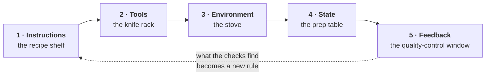

# The harness of the harness

This repository is a harness, and it is governed by one. The five folders below are the
five parts of a harness — instructions, tools, environment, state, feedback — applied to
this project's own work.

That is not a joke about recursion. A standard whose own repository does not meet it is a
suggestion, and the fastest way to find out that a rule is unworkable is to be bound by it
while writing the tool that enforces it. Two rules in `1-instructions/CONSTRAINTS.md` exist
because they caught something here first.

| Folder | What it holds |
|---|---|
| `1-instructions/` | The rules for working in this repository, each labelled with what enforces it |
| `2-tools/` | What this project can run |
| `3-environment/` | What it runs in, and the baseline for the locked-surface rule |
| `4-state/` | `PROGRESS.md`, `DECISIONS.md`, and the work queue |
| `5-feedback/` | The map of the checks |

Unfinished work crosses sessions through [`../specs/TRACKS.md`](../specs/TRACKS.md).

For what the *standard* is, rather than how this repository runs, read
[`../docs/STANDARD.md`](../docs/STANDARD.md); for the fastest way in,
[`../docs/GUIDE.md`](../docs/GUIDE.md). The model comes from
[Learn Harness Engineering](https://walkinglabs.github.io/learn-harness-engineering/ru/).
