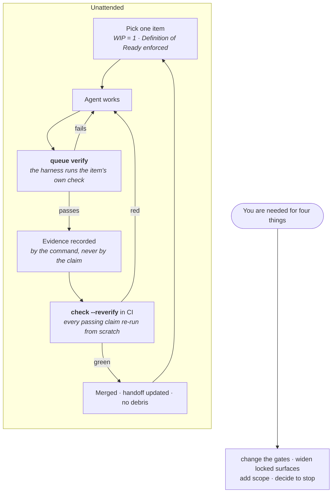

# Harnessimo

[](https://github.com/atamaniuc/Harnessimo/actions/workflows/ci.yml)
[](LICENSE)
[](https://github.com/atamaniuc/Harnessimo/releases/latest)
[](https://atamaniuc.github.io/Harnessimo/)
[](package.json)

<p align="center">
  
</p>

> **Your agent can run unattended exactly as far as something other than the agent decides
> when the work is done.** Harnessimo is that something: eight checks that turn *"I believe
> this is done"* into *"a command says so"*.

```bash
pnpm add -D github:atamaniuc/Harnessimo#v0.3.0
pnpm exec harnessimo init            # reads your repo, writes a config that already passes
pnpm exec harnessimo hooks install --agent   # every session starts knowing where things stand
pnpm exec harnessimo check           # the one command CI runs
```

Zero dependencies. No build step. One config file. Works on any language — it reads your
files, runs your commands, and walks your git history. <!-- proof: package.json:"files" -->

## The three ways agent work rots

Not hypotheticals. Each is a real failure from the repositories this was extracted from:

1. **The docs describe software that does not exist.** A README claimed infrastructure was
   "stood up through a single Pulumi program in `infra/`" while `infra/` had never been
   created. Ten such claims came out of one audit.
2. **"Done" is a self-report.** A queue item sat at `passing` with invented evidence.
   Nothing ever re-ran it.
3. **Every session starts from zero.** Context dies with the session; the next one
   re-derives it, re-decides settled questions, and re-reads what it should have skipped.

A capable model does not fix any of these. It produces them faster.

## What you get

| Killer feature | What it means in practice |
|---|---|
| **The agent cannot mark its own work done** | Only `queue verify` writes state, and only after the item's own command exits zero. CI re-runs every passing claim, so a hand-edited state fails there. <!-- proof: src/queue.mjs:verifyItem --> |
| **Documentation that cannot lie** | Every claim carries `<!-- proof: <path> -->`. Delete the test it names and the build goes red. Your README stops being a liability. <!-- proof: src/proof.mjs:checkTarget --> |
| **Sessions inherit state instead of memory** | A track index, a handoff per lane, and a SessionStart hook that *hands* it to the agent at startup — so "read the handoff first" is not a rule someone has to remember. <!-- proof: src/brief.mjs:briefText --> |
| **The scoring is out of the agent's reach** | An agent commit touching the files that define success fails the build. A loop that can edit its own scorer will. <!-- proof: src/locked.mjs:lockedViolations --> |
| **A fresh clone must actually run** | Cold start clones into an empty directory and runs your documented commands. The honest test of your setup instructions. <!-- proof: src/coldstart.mjs:coldStartProblems --> |
| **Sessions leave no debris** | Leftover `TODO`, `debugger`, `.only(`, or a progress file that went stale while the code moved. All things a build compiles happily. <!-- proof: src/cleanexit.mjs:debrisProblems --> |
| **It tells you what it does *not* enforce** | `harnessimo doctor` lists the checks you did not turn on. A team that assumes a check exists stops looking for the missing one. <!-- proof: test/cli.test.mjs#doctor reports what is enforced and what is not, without overstating --> |
| **Adoption is one command** | `init` reads your command runner, source layout, migrations and CI, then writes a config whose **first run is green**. <!-- proof: test/detect.test.mjs#strict mode is off until a document actually carries a marker --> |

## The loop that runs without you



## Greenfield or brownfield

**Greenfield** — one command and the discipline is there before the first bad habit is:

```bash
pnpm exec harnessimo init && pnpm exec harnessimo check
```

You get `.harness/` (rules, tools, environment, state, feedback), `specs/` (tracks and
handoffs), and a config with only the checks your repo can already satisfy.

**Brownfield** — nothing is switched on that you did not ask for. Turn on the one that
matches a problem you actually have, get it green, commit, take the next:

| Your problem | Turn on |
|---|---|
| README describes things that no longer exist | `docs` |
| Work restarts from scratch each session | `tracks` |
| Ticked boxes nobody can trace | `tracks.gateTasks` |
| "Done" that turns out not to be | `queue` |
| Only works on the machine that built it | `coldStart` |
| Debug leftovers, stale progress notes | `cleanExit` |
| The agent file is a 600-line manual | `instructions` |
| An agent editing what grades it | `locked` |

Both paths, with the migration details: [**Adopting**](https://atamaniuc.github.io/Harnessimo/ADOPTING/).

## Proof it survives contact with real repositories

Two production repositories run on it, and both dropped their own copies of these rules:

- [`ledger-lens`](https://github.com/atamaniuc/ledger-lens) — Next.js, Supabase, Python,
  evals. Delegated its documentation gates to the package: **all 38 of its own unit tests
  passed untouched**, and the numbers matched to the marker (183 proof markers across 71
  documents, before and after).
- [`code-knowledge-base`](https://github.com/atamaniuc/code-knowledge-base) — deleted its
  queue tool, locked-surface script, cold-start script and readiness package; gained proof
  markers, work tracks and the task gate for the price of a config file.

This repository runs every check it defines against itself, from a fresh clone included.
<!-- proof: npm run check -->

## What it does not do

- **`locked` is drift detection, not a sandbox.** It assumes commits pass through CI.
- **It cannot tell whether a check is any good.** A test that asserts nothing satisfies
  every rule here. It makes claims falsifiable; it does not make them true.
- **It does not review code** for correctness, security or taste.
- **It is not a context/indexing tool.** Pair it with a code-graph or codebase-memory MCP —
  they answer "what do I need to read", this answers "is it finished". Why they stay
  separate: [the README section on it](https://atamaniuc.github.io/Harnessimo/#what-pairs-with-it).

## Documentation

**<https://atamaniuc.github.io/Harnessimo/>**

- [The 15-minute guide](https://atamaniuc.github.io/Harnessimo/GUIDE/) · [по-русски](https://atamaniuc.github.io/Harnessimo/GUIDE.ru/)
- [The standard](https://atamaniuc.github.io/Harnessimo/STANDARD/) — why each rule exists, and which lecture of [Learn Harness Engineering](https://walkinglabs.github.io/learn-harness-engineering/ru/) it comes from
- [Adopting an existing repository](https://atamaniuc.github.io/Harnessimo/ADOPTING/)
- [Contributing](CONTRIBUTING.md)

## Development

```bash
npm test        # 105 tests, no install needed — the package has no dependencies
npm run check   # the tests, then this repository's own gates
```

Rules in `src/` are pure functions over strings and in-memory trees; `src/resolver.mjs` and
`bin/harnessimo.mjs` are the only code that touches the filesystem. <!-- proof: test/cli.test.mjs -->

## License

[MIT](LICENSE) — fork it, vendor it, ship it commercially. If you extend a rule, a pull
request beats a fork: a rule that exists twice is the problem this removes.
