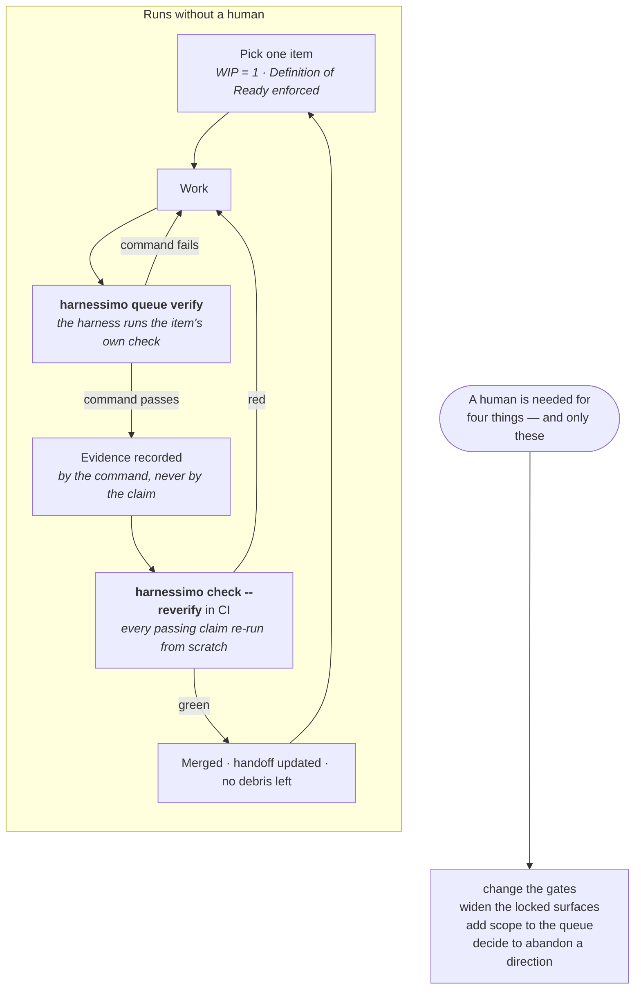

# Harnessimo

[](https://github.com/atamaniuc/Harnessimo/actions/workflows/ci.yml)
[](LICENSE)
[](package.json)
[](package.json)
[](https://github.com/atamaniuc/Harnessimo/releases/latest)
[](https://atamaniuc.github.io/Harnessimo/)

<p align="center">
  
</p>

## Autonomy needs an arbiter

An agent runs unattended exactly as far as something **other than the agent** decides when
the work is done. Take that away and you are not supervising less — you are trusting a
self-report, and self-reports are where unattended runs go wrong.

Harnessimo is that arbiter: eight checks that turn *"I believe this is done"* into *"a
command says so"*, plus the structure that makes those checks possible — rules, a work
queue, protected scoring, and state that survives a session ending.

Zero dependencies, no build step, one config file. <!-- proof: package.json:"files" -->

> **New here? Read the [15-minute guide](https://atamaniuc.github.io/Harnessimo/GUIDE/)**
> ([по-русски](https://atamaniuc.github.io/Harnessimo/GUIDE.ru/)) — the shortest path from
> "what is this" to a green check in your own repository. Full documentation, with the
> diagrams rendered: **<https://atamaniuc.github.io/Harnessimo/>**

```bash
pnpm add -D github:atamaniuc/Harnessimo#v0.1.0
pnpm exec harnessimo init      # reads your repo and writes a config that already passes
pnpm exec harnessimo doctor    # what is actually enforced here
pnpm exec harnessimo check     # the one command CI runs
pnpm exec harnessimo hooks install   # the same gate, on every commit
```

`init` is not a template drop. It looks at what the repository has — your command runner,
your source directories, your migrations, whether your CI directory exists — turns on the
checks it can satisfy, and prints what it left off and why. **The first run after `init` is
green**, so every red run after it means something.
<!-- proof: test/detect.test.mjs#strict mode is off until a document actually carries a marker -->

```
configured from what this repository has:
  on   make commands in Makefile
  on   cold start: pnpm install --frozen-lockfile && make check
  on   clean exit over src, scripts
left off, and why — these are gaps, not failures:
  off  strict mode off: README.md carries no proof marker yet. Add one, then list it in docs.mustCarryProof
```

## What a harness is

Everything in the engineering infrastructure outside the model's weights. It has five
subsystems, and the kitchen comparison is the clearest way in: a kitchen with no knives is
still a kitchen, and you will not cook in it.


The five subsystems say how a project is governed. They say nothing about what happens when
a session ends **mid-task**, which is the normal case — so a sixth thing sits on top:
**handoff-driven development**, an index of live work tracks and a handoff per track,
written for a reader with none of your context.

The model, the vocabulary and the kitchen comparison come from
[**Learn Harness Engineering**](https://walkinglabs.github.io/learn-harness-engineering/ru/).
This repository is one executable implementation of it —
[`docs/STANDARD.md`](docs/STANDARD.md) maps every check to the lecture it comes from.

## What it checks

| Check | Fails when | Lecture |
|---|---|---|
| `harnessimo proof` | a documented claim's test, file or command no longer exists <!-- proof: src/proof.mjs:checkTarget --> | 03 · repository as source of truth |
| `harnessimo tracks` | a track links a deleted handoff, or carries no status <!-- proof: src/tracks.mjs:checkTracks --> | 05 · continuity between sessions |
| `harnessimo tasks` | a checked box names no executable check <!-- proof: src/tasks.mjs:checkTaskGate --> | 08 · feature lists as primitives |
| `harnessimo queue` | an item claiming `passing` fails when re-run <!-- proof: src/queue.mjs:checkQueue --> | 08, 09 · the passing-state gate |
| `harnessimo cold-start` | a fresh clone cannot install and verify itself <!-- proof: src/coldstart.mjs:coldStartProblems --> | 03, 10 · end-to-end as ground truth |
| `harnessimo clean-exit` | a session left debris, or never wrote down where it got to <!-- proof: src/cleanexit.mjs:debrisProblems --> | 12 · clean state |
| `harnessimo instructions` | the instruction file grew from a router into a manual <!-- proof: src/cleanexit.mjs:instructionProblems --> | 04 · one giant file fails |
| `harnessimo locked` | an agent commit touched the files that define success <!-- proof: src/locked.mjs:lockedViolations --> | — |

Failures are written to be acted on, not just read:

```
  FAIL  proof markers
    README.md:14  make deploy
        no make command named "deploy"
```

## What actually runs unattended

Five of the eight checks exist so an agent can work without someone reading every diff. The
loop below is the whole mechanism: the agent never writes the word `passing`, and CI re-runs
every claim that says it.



What makes each turn of that loop safe to leave alone:

- **The agent cannot mark its own work done.** Only `queue verify` writes state, and only
  after the item's own command exits zero. <!-- proof: src/queue.mjs:verifyItem -->
- **A claim is re-run, not believed.** `--reverify` executes every passing item's command
  again in CI, so a state edited by hand fails there.
- **The scoring is out of reach.** An agent commit that touches the files defining success
  fails the build — because a loop that can edit its own scorer will.
  <!-- proof: src/locked.mjs:lockedViolations -->
- **The next session starts from written state, not memory.** Track index, handoffs,
  decisions log — and a check that fails when any of them has gone stale.
- **Nothing is left behind.** No debris, no unwritten progress, and a fresh clone still
  runs. <!-- proof: src/coldstart.mjs:coldStartProblems -->

## The problem, concretely

Every failure below is real, taken from the two repositories this was extracted from:

- A README claimed "all deployable infrastructure is stood up through a single Pulumi
  program in `infra/`" while `infra/` did not exist. Ten such claims came out of one audit.
- A queue item was marked `passing` with invented evidence. Nothing re-ran it.
- A reorganisation moved a script and left the command that verifies it pointing at the old
  path. CI failed on every push for a day before anyone read the log.
- An agent file routed the reader to a plans directory in the author's home folder, outside
  the repository. The project only documented itself for the person who wrote it.

None are exotic. They are what happens when the thing that decides "done" is prose, memory,
or a copy of a script that drifted. Each has a check here.

## Configuration

`harnessimo.config.json`. Every section is optional, and **a section you leave out is a check
that does not run** — `harnessimo doctor` reports it as not set rather than implying otherwise.
<!-- proof: test/cli.test.mjs#doctor reports what is enforced and what is not, without overstating -->

```jsonc
{
  "docs":   { "roots": [".", "docs", "specs"],
              "mustCarryProof": ["README.md"],
              "commands": { "make": "Makefile" } },   // or task / npm run / pnpm run
  "tracks": { "file": "specs/TRACKS.md", "gateTasks": true },
  "queue":  { "file": ".harness/4-state/feature_list.json" },
  "locked": { "paths": [".github/workflows/"], "agentTrailer": "Co-Authored-By: Claude" },
  "coldStart":    { "requiredFiles": ["AGENTS.md"], "commands": ["make setup", "make check"] },
  "cleanExit":    { "scan": ["src"], "progressFile": ".harness/4-state/PROGRESS.md" },
  "instructions": { "limits": { "AGENTS.md": 200 } }
}
```

Adopting an existing repository, step by step: [`docs/ADOPTING.md`](docs/ADOPTING.md).

## What pairs with it (and why it is not bundled)

The most common question: should a code-graph or codebase-memory tool —
[codebase-memory-mcp](https://github.com/DeusData/codebase-memory-mcp),
[CodeGraph](https://github.com/codegraph-ai/CodeGraph),
[CodeGraphContext](https://github.com/CodeGraphContext/CodeGraphContext) — be part of this?

**They belong together and they are not the same job.** Those tools index a repository into a
local graph of functions, calls and imports, and serve it to the agent over MCP; they answer
*"what do I need to read"*. Harnessimo answers *"is this finished"*. One shapes the input to
a session, the other gates its output.

They also attack the same friction from opposite ends: a handoff's **what NOT to load**
section and a code graph both exist to stop a session spending its budget rediscovering the
repository.

Three reasons the graph stays a separate install rather than a dependency here:

- **Zero dependencies and zero services is a property, not a pose.** It is what makes
  `harnessimo cold-start` measure the repository instead of a package registry, and what
  lets `npm test` run on a clean checkout with no install step at all.
- **They run in different places.** An MCP server lives in the agent's environment; these
  gates run in CI, where no agent and no MCP client exists.
- **An index is a cache, and a gate must not depend on one.** A stale index misleads; a gate
  that trusts it inherits the lie. If you keep one, treat it as state: gitignore the index,
  document the rebuild command in `.harness/2-tools/`, and — if it matters enough — make
  rebuilding it a queue item with its own verification, which needs no code from here.

Use both. Wire neither into the other.

## What this does not do

Stated plainly, because a check that overstates its guarantee stops anyone looking for the
missing one:

- **`harnessimo locked` is drift detection, not a sandbox.** It assumes commits pass through
  CI. An agent with push access that strips its own authorship trailer defeats it.
- **It cannot tell whether a check is any good.** A test that asserts nothing satisfies
  every rule here. The harness makes claims falsifiable; it does not make them true.
- **It does not review code** for correctness, security or taste.
- **Four of this repository's own constraints are review-only**, and
  [say so](.harness/1-instructions/CONSTRAINTS.md).

## Development

```bash
npm test        # 93 tests, no install needed — the package has no dependencies
npm run check   # the tests, then this repository's own gates
```

The rules in `src/` are pure functions over strings and in-memory trees;
`src/resolver.mjs` and `bin/harnessimo.mjs` are the only code that touches the filesystem.
That split is why the rule layer is exhaustively tested and the wiring gets end-to-end
tests against real directories. <!-- proof: test/cli.test.mjs -->

This repository runs every check it defines against itself, from a fresh clone included.
A standard whose own repository does not meet it is a suggestion. <!-- proof: npm run check -->

## Where it came from

The model and its vocabulary come from
[Learn Harness Engineering](https://walkinglabs.github.io/learn-harness-engineering/ru/).
Handoff-driven development comes from
[yetanothervan/handoff-driven-development](https://github.com/yetanothervan/handoff-driven-development).

The implementation was extracted from two repositories, each of which had grown half of it:
[`code-knowledge-base`](https://github.com/atamaniuc/code-knowledge-base) contributed the
five-subsystem structure, the queue, locked surfaces and the cold-start test;
[`ledger-lens`](https://github.com/atamaniuc/ledger-lens) contributed proof markers,
handoff-driven development and the task gate. Neither could use the other's half without
copying it, and a copied check is a fork the day after it is copied.

## License and reuse

[MIT](LICENSE) — fork it, vendor it, rename it, ship it in a commercial product. No
attribution beyond the licence text, no obligation to contribute anything back.

If you extend a rule, the useful shape is a pull request rather than a fork: a rule that
exists twice is the problem this repository was built to remove.
