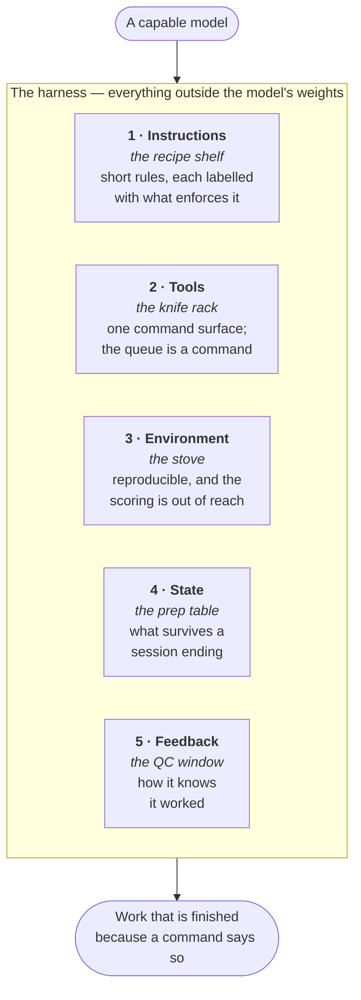

# harness

[](https://github.com/atamaniuc/harness/actions/workflows/ci.yml)
[](LICENSE)
[](package.json)
[](package.json)

**A capable model with a bad harness produces work that looks finished and is not.**

This is the harness: eight checks that turn *"I believe this is done"* into *"a command
says so"*, and a structure for the parts of a project that decide whether that command can
exist at all.

Zero dependencies, no build step, one config file. <!-- proof: package.json:"files" -->

> **New here? Read the [15-minute guide](docs/GUIDE.md)** ([по-русски](docs/GUIDE.ru.md)).
> It is the shortest path from "what is this" to a green check in your own repository.

```bash
pnpm add -D github:atamaniuc/harness
pnpm exec harness init      # scaffold .harness/, specs/, harness.config.json
pnpm exec harness doctor    # what is actually enforced here
pnpm exec harness check     # the one command CI runs
```

## What a harness is

Everything in the engineering infrastructure outside the model's weights. It has five
subsystems, and the kitchen comparison is the clearest way in: a kitchen with no knives is
still a kitchen, and you will not cook in it.



The five subsystems say how a project is governed. They say nothing about what happens when
a session ends **mid-task**, which is the normal case — so a sixth thing sits on top:
**handoff-driven development**, an index of live work tracks and a handoff per track,
written for a reader with none of your context.

The model, the vocabulary and the kitchen comparison come from
[**Learn Harness Engineering**](https://walkinglabs.github.io/learn-harness-engineering/ru/).
This repository is one executable implementation of it —
[`docs/STANDARD.md`](docs/STANDARD.md) maps every check to the lecture it comes from.

## What it checks

| Check | Fails when | Lecture |
|---|---|---|
| `harness proof` | a documented claim's test, file or command no longer exists <!-- proof: src/proof.mjs:checkTarget --> | 03 · repository as source of truth |
| `harness tracks` | a track links a deleted handoff, or carries no status <!-- proof: src/tracks.mjs:checkTracks --> | 05 · continuity between sessions |
| `harness tasks` | a checked box names no executable check <!-- proof: src/tasks.mjs:checkTaskGate --> | 08 · feature lists as primitives |
| `harness queue` | an item claiming `passing` fails when re-run <!-- proof: src/queue.mjs:checkQueue --> | 08, 09 · the passing-state gate |
| `harness cold-start` | a fresh clone cannot install and verify itself <!-- proof: src/coldstart.mjs:coldStartProblems --> | 03, 10 · end-to-end as ground truth |
| `harness clean-exit` | a session left debris, or never wrote down where it got to <!-- proof: src/cleanexit.mjs:debrisProblems --> | 12 · clean state |
| `harness instructions` | the instruction file grew from a router into a manual <!-- proof: src/cleanexit.mjs:instructionProblems --> | 04 · one giant file fails |
| `harness locked` | an agent commit touched the files that define success <!-- proof: src/locked.mjs:lockedViolations --> | — |

Failures are written to be acted on, not just read:

```
  FAIL  proof markers
    README.md:14  make deploy
        no "make" command named "deploy"
```

## The problem, concretely

Every failure below is real, taken from the two repositories this was extracted from:

- A README claimed "all deployable infrastructure is stood up through a single Pulumi
  program in `infra/`" while `infra/` did not exist. Ten such claims came out of one audit.
- A queue item was marked `passing` with invented evidence. Nothing re-ran it.
- A reorganisation moved a script and left the command that verifies it pointing at the old
  path. CI failed on every push for a day before anyone read the log.
- An agent file routed the reader to a plans directory in the author's home folder, outside
  the repository. The project only documented itself for the person who wrote it.

None are exotic. They are what happens when the thing that decides "done" is prose, memory,
or a copy of a script that drifted. Each has a check here.

## Configuration

`harness.config.json`. Every section is optional, and **a section you leave out is a check
that does not run** — `harness doctor` reports it as not set rather than implying otherwise.
<!-- proof: test/cli.test.mjs#doctor reports what is enforced and what is not, without overstating -->

```jsonc
{
  "docs":   { "roots": [".", "docs", "specs"],
              "mustCarryProof": ["README.md"],
              "commands": { "make": "Makefile" } },   // or task / npm run / pnpm run
  "tracks": { "file": "specs/TRACKS.md", "gateTasks": true },
  "queue":  { "file": ".harness/4-state/feature_list.json" },
  "locked": { "paths": [".github/workflows/"], "agentTrailer": "Co-Authored-By: Claude" },
  "coldStart":    { "requiredFiles": ["AGENTS.md"], "commands": ["make setup", "make check"] },
  "cleanExit":    { "scan": ["src"], "progressFile": ".harness/4-state/PROGRESS.md" },
  "instructions": { "limits": { "AGENTS.md": 200 } }
}
```

Adopting an existing repository, step by step: [`docs/ADOPTING.md`](docs/ADOPTING.md).

## What this does not do

Stated plainly, because a check that overstates its guarantee stops anyone looking for the
missing one:

- **`harness locked` is drift detection, not a sandbox.** It assumes commits pass through
  CI. An agent with push access that strips its own authorship trailer defeats it.
- **It cannot tell whether a check is any good.** A test that asserts nothing satisfies
  every rule here. The harness makes claims falsifiable; it does not make them true.
- **It does not review code** for correctness, security or taste.
- **Four of this repository's own constraints are review-only**, and
  [say so](.harness/1-instructions/CONSTRAINTS.md).

## Development

```bash
npm test        # 73 tests, no install needed — the package has no dependencies
npm run check   # the tests, then this repository's own gates
```

The rules in `src/` are pure functions over strings and in-memory trees;
`src/resolver.mjs` and `bin/harness.mjs` are the only code that touches the filesystem.
That split is why the rule layer is exhaustively tested and the wiring gets end-to-end
tests against real directories. <!-- proof: test/cli.test.mjs -->

This repository runs every check it defines against itself, from a fresh clone included.
A standard whose own repository does not meet it is a suggestion. <!-- proof: npm run check -->

## Where it came from

The model and its vocabulary come from
[Learn Harness Engineering](https://walkinglabs.github.io/learn-harness-engineering/ru/).
Handoff-driven development comes from
[yetanothervan/handoff-driven-development](https://github.com/yetanothervan/handoff-driven-development).

The implementation was extracted from two repositories, each of which had grown half of it:
[`code-knowledge-base`](https://github.com/atamaniuc/code-knowledge-base) contributed the
five-subsystem structure, the queue, locked surfaces and the cold-start test;
[`ledger-lens`](https://github.com/atamaniuc/ledger-lens) contributed proof markers,
handoff-driven development and the task gate. Neither could use the other's half without
copying it, and a copied check is a fork the day after it is copied.

## License and reuse

[MIT](LICENSE) — fork it, vendor it, rename it, ship it in a commercial product. No
attribution beyond the licence text, no obligation to contribute anything back.

If you extend a rule, the useful shape is a pull request rather than a fork: a rule that
exists twice is the problem this repository was built to remove.
