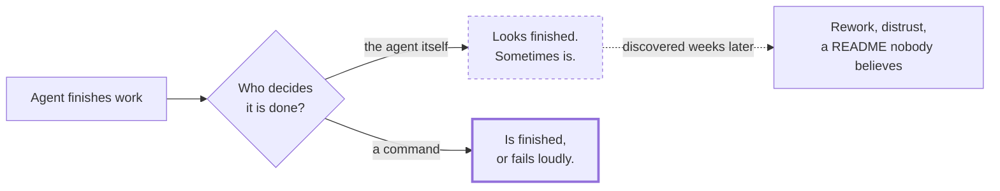
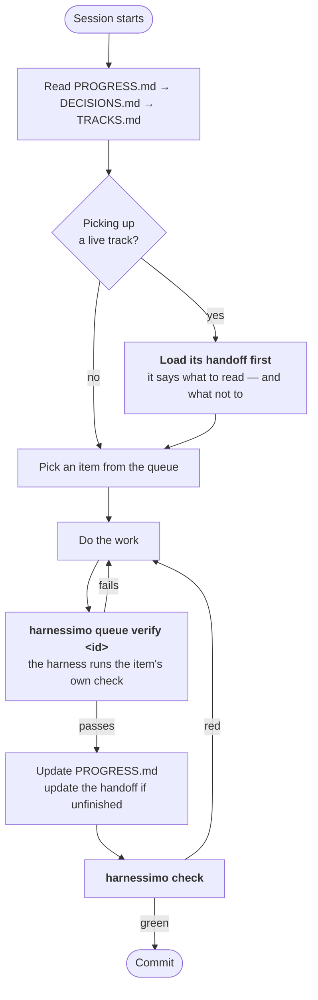
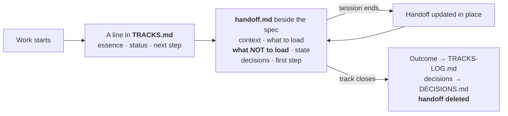

# The 15-minute guide

What this is, why you would want it, and how to get a green check in your own repository.
Read top to bottom; it is meant to be finished in one sitting.


## 1. Why

You ask an agent for a feature. It writes code, runs a test, and reports success. Six of
those reports are true. The seventh looks identical and is not: the test asserted nothing,
or the documentation now describes a capability that was never built, or the task list has
a tick nobody can trace to anything.

The problem is not the model. It is that **"done" was decided by whoever did the work.**



This tool moves that decision out of prose and into commands that exit non-zero.

## 2. The idea in one sentence

**Every claim names the thing that proves it, and a command re-checks all of them.**

A claim is a claim wherever it lives, so all three claim-shaped things go through the same
checker:

| Where the claim lives | What proves it |
|---|---|
| A sentence in a document | `<!-- proof: path/to/file.ts:<aSymbol> -->` |
| A ticked box in a task list | the same marker, on the task |
| An item in the work queue | its verification command, re-run in CI |

## 3. Three minutes to a green check

=== "pnpm"

    ```bash
    pnpm add -D harnessimo
    pnpm exec harnessimo init
    pnpm exec harnessimo check
    ```

=== "npm"

    ```bash
    npm i -D harnessimo
    npx harnessimo init
    npx harnessimo check
    ```

=== "yarn"

    ```bash
    yarn add -D harnessimo
    yarn harnessimo init
    yarn harnessimo check
    ```

=== "bun"

    ```bash
    bun add -d harnessimo
    bunx harnessimo init
    bunx harnessimo check
    ```

Later examples write `harnessimo …` on its own: prefix it with your runner — `pnpm exec`,
`npx`, `yarn` or `bunx`.

`init` reads your repository first — command runner, source directories, migrations, CI —
and writes a configuration that already passes. Then three things and nothing else:

```
.harness/            the five subsystems, with starter documents
  1-instructions/    your rules — rewrite these, they ship as examples
  2-tools/           what your project can run
  3-environment/     how it reproduces, and what agents may not touch
  4-state/           PROGRESS.md, DECISIONS.md, the work queue
  5-feedback/        the map of your checks
specs/               TRACKS.md (live work), templates for a spec and a handoff
harnessimo.config.json  which checks you asked for
```

The scaffold passes its own check immediately, so your first green run costs nothing —
and every red one after that means something.
<!-- proof: test/cli.test.ts#init scaffolds a working harness that immediately passes its own check -->

Then run:

```bash
harnessimo doctor
```

It prints what is enforced and what is not. **A section you leave out of the config is a
check that does not run, and `doctor` says so.** That honesty is the point: a team that
believes a check exists stops looking for the missing one.

## 4. Turn on what hurts

Do not switch on all nine at once. Pick the one matching a problem you actually have,
make it green, commit, then take the next.

| The problem you have | Turn on | It fails when |
|---|---|---|
| The README describes things that no longer exist | `docs` | a claim's file, test or command is gone |
| Work restarts from scratch each session | `tracks` | a track has no status, or links a deleted handoff |
| Ticked boxes nobody can trace | `tracks.gateTasks` | a checked box names no check |
| "Done" that turns out not to be | `queue` | an item claiming to pass fails when re-run |
| Only works on the machine that built it | `coldStart` | a fresh clone cannot verify itself |
| Debug leftovers, stale progress notes | `cleanExit` | a session left debris or wrote nothing down |
| The agent file has become a 600-line manual | `instructions` | it is over its line limit |
| An agent editing what grades it | `locked` | an agent commit touched those paths |
| npm, the tags and the changelog telling different stories | `release` | a released version has no tag, or the changelog's top entry is not what ships |

## 5. What a session looks like

The daily loop, once it is set up. Two commands out of the five are the harness; the rest
is ordinary work.



Two rules make this work, and both are enforced rather than agreed:

- **You never write `passing` yourself.** Only `harnessimo queue verify` does, and only after
  running the item's own command. CI re-runs every such claim, so a hand-edited state is
  detected rather than trusted.
- **One item at a time.** Split attention produces work that is started everywhere and
  finished nowhere.

## 6. Unfinished work crosses the session boundary

A session ends and its memory is gone. The queue says *which* item is in flight; it does
not say where you stopped, what you already tried, or — most valuably — what the next
session should **not** read.



The index is machine-checked, because **a handoff that lies is worse than no handoff** —
the next session trusts it. A line with no status, or one linking a handoff that was
deleted, fails the gate. <!-- proof: src/tracks.ts:checkHandoffRefs -->

The "what NOT to load" section is the half everyone skips and the one that pays for the
practice: a fresh session's budget goes on whatever you failed to rule out.

## 7. On every commit

```bash
harnessimo hooks install
```

Writes `.githooks/pre-commit` and points git at it, so the fast checks run
before a commit lands rather than after CI has spent four minutes on it.

It runs **only** the second-scale gates. Re-verification, the cold start and your
test suite stay in CI, where waiting costs nobody anything — a hook that makes
every commit slow gets bypassed with `--no-verify`, and a bypassed hook enforces
nothing. If your project has its own fast command, name it in the config and the
hook runs it first:

```jsonc
{ "hooks": { "before": ["npm run validate >/dev/null"] } }
```

`harnessimo hooks status` answers the question nobody thinks to ask: the file
exists, but is git actually using it? A hook that was never wired up looks
exactly like one that passes.

## 7b. In CI

One job. It runs the same command you run locally, so there is no "works on my machine"
gap to argue about:

```yaml
- run: npx harnessimo check --reverify
```

`--reverify` re-runs every item claiming to pass. That is the line that makes the queue's
evidence *evidence* rather than a string someone typed.

Two checks need a commit range and get their own step:

```yaml
- run: npx harnessimo locked     "${{ github.event.pull_request.base.sha }}" HEAD
- run: npx harnessimo clean-exit "${{ github.event.pull_request.base.sha }}" HEAD
```

## 8. Questions people actually ask

**Do I have to adopt all of it?** No. One check is a real improvement, and `doctor` will
keep telling you the truth about the other seven.

**Does this replace my tests?** No. It checks that your claims point at things that exist
and still pass. A test that asserts nothing satisfies every rule here.

**My repository is not JavaScript.** Fine — the checks read files, run your commands and
walk git. Point `docs.commands` at your `Makefile` and carry on. Node is needed to run the
tool, nothing else.

**Isn't this a lot of ceremony?** The queue is for work worth a session; small fixes go
straight in. Ceremony that costs more than the error it prevents is not discipline, it is
overhead — and a gate people bypass enforces nothing.

**Should I also run a code-graph / codebase-memory tool?** Yes, and separately. Those index
your repository and serve it to the agent over MCP — they answer "what do I need to read".
This answers "is it finished". They meet the same friction from opposite ends: a handoff's
*what NOT to load* and a code graph both stop a session rediscovering the repository. Keep
them as separate installs; the README's "What pairs with it" says why bundling them would
cost more than it gives.

**What happens when a rule is wrong?** Open an issue or a PR. A rule that exists twice,
once here and once forked into your repository, is the problem this was built to remove.

## 9. Where to go next

- [`ADOPTING.md`](ADOPTING.md) — migrating a repository that already has its own checks.
- [`STANDARD.md`](STANDARD.md) — the reasoning behind each rule, and which lecture of
  [Learn Harness Engineering](https://walkinglabs.github.io/learn-harness-engineering/ru/)
  it comes from.
- `harnessimo help` — every command, with its arguments.
