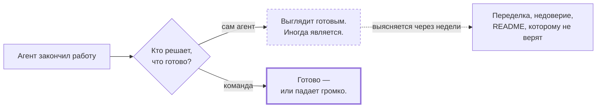
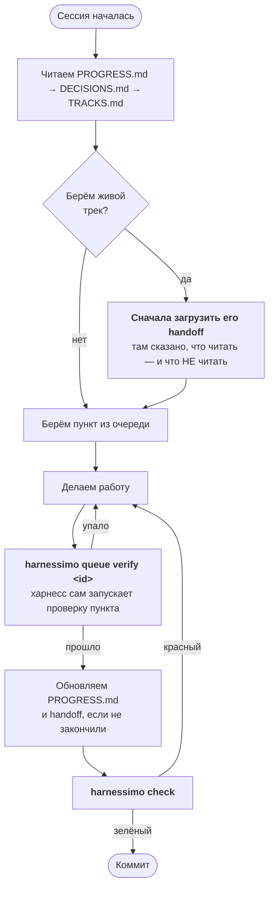
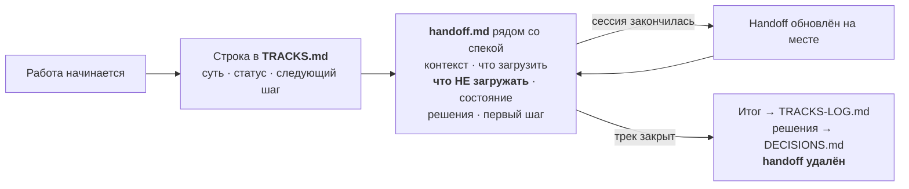

# Гайд на 15 минут

Что это, зачем оно вам и как получить зелёную проверку в своём репозитории. Читается
сверху вниз за один присест.

English version: [GUIDE.md](GUIDE.md).

## 1. Зачем

Вы просите агента сделать фичу. Он пишет код, гоняет тест и рапортует об успехе. Шесть
таких отчётов правдивы. Седьмой выглядит точно так же и правдивым не является: тест ничего
не проверяет, документация описывает возможность, которой никогда не было, а в списке
задач стоит галочка, которую не к чему привязать.

Проблема не в модели. Проблема в том, что **«готово» решил тот, кто делал работу.**



Курс [Learn Harness Engineering](https://walkinglabs.github.io/learn-harness-engineering/ru/)
называет это «экстернализировать суждение о завершении»: современные модели систематически
сверх-уверены в собственной работе, поэтому судить о готовности должно что-то внешнее. Этот
инструмент — исполняемая версия того же принципа.

## 2. Идея одним предложением

**Каждое утверждение называет то, что его доказывает, а команда перепроверяет их все.**

Утверждение — это утверждение, где бы оно ни жило, поэтому все три их вида проходят через
один и тот же чекер:

| Где живёт утверждение | Что его доказывает |
|---|---|
| Фраза в документе | `<!-- proof: path/to/file.ts:<aSymbol> -->` |
| Галочка в списке задач | тот же маркер, на самой задаче |
| Пункт очереди работ | его команда верификации, перезапускаемая в CI |

## 3. Три минуты до зелёной проверки

```bash
pnpm add -D github:atamaniuc/harnessimo     # или: npm i -D github:atamaniuc/harnessimo
pnpm exec harnessimo init
pnpm exec harnessimo check
```

`init` сначала читает ваш репозиторий — чем запускаются команды, где исходники, есть ли
миграции и CI — и пишет конфиг, который уже проходит. Затем создаёт ровно три вещи:

```
.harness/            пять подсистем со стартовыми документами
  1-instructions/    ваши правила — перепишите, они лежат как примеры
  2-tools/           что проект умеет запускать
  3-environment/     как воспроизводится и что агенту трогать нельзя
  4-state/           PROGRESS.md, DECISIONS.md, очередь работ
  5-feedback/        карта ваших проверок
specs/               TRACKS.md (живая работа), шаблоны спеки и handoff
harnessimo.config.json  какие проверки вы включили
```

Скаффолд сразу проходит собственную проверку, поэтому первый зелёный прогон ничего не
стоит — а каждый красный после него что-то значит.

Дальше:

```bash
pnpm exec harnessimo doctor
```

Печатает, что реально включено, а что нет. **Секция, которую вы не указали в конфиге, —
это проверка, которая не работает, и `doctor` об этом говорит.** В этой честности весь
смысл: команда, верящая в несуществующую проверку, перестаёт искать недостающую.

## 4. Включайте то, что болит

Не включайте все восемь сразу. Возьмите ту, что отвечает реальной боли, добейтесь зелёного,
закоммитьте — потом следующую.

| Ваша боль | Включить | Падает, когда |
|---|---|---|
| README описывает то, чего уже нет | `docs` | файл, тест или команда из утверждения исчезли |
| Каждая сессия начинается заново | `tracks` | у трека нет статуса или ссылка на удалённый handoff |
| Галочки, которые не к чему привязать | `tracks.gateTasks` | отмеченная задача не называет проверку |
| «Готово», которое оказалось не готово | `queue` | пункт со статусом passing падает при перезапуске |
| Работает только на машине автора | `coldStart` | свежий клон не может себя проверить |
| Отладочный мусор, устаревший PROGRESS | `cleanExit` | сессия оставила мусор или ничего не записала |
| Файл инструкций разросся в мануал на 600 строк | `instructions` | он вышел за лимит строк |
| Агент правит то, что его оценивает | `locked` | коммит агента тронул эти пути |

## 5. Как выглядит рабочая сессия

Ежедневный цикл после настройки. Две команды из пяти — это харнесс, остальное — обычная
работа.



Две вещи делают это рабочим, и обе принудительны, а не по договорённости:

- **Вы никогда не пишете `passing` сами.** Это делает только `harnessimo queue verify` и
  только после запуска команды самого пункта. Курс называет это «гейт по состоянию
  passing». CI перезапускает каждое такое утверждение, поэтому вручную выставленный статус
  обнаруживается, а не принимается на веру.
- **Один пункт за раз.** Рассеянное внимание рождает работу, начатую везде и не законченную
  нигде.

## 6. Незаконченная работа переживает конец сессии

Сессия закончилась — её память исчезла. Очередь говорит, *какой* пункт в работе; она не
говорит, где вы остановились, что уже пробовали и — самое ценное — что следующей сессии
читать **не надо**.



Индекс проверяется машиной, потому что **лживый handoff хуже, чем его отсутствие** —
следующая сессия ему верит. Строка без статуса или ссылка на удалённый handoff роняет гейт.

Раздел «что НЕ загружать» все пропускают — и именно он окупает всю практику: бюджет свежей
сессии уходит на то, что вы не отсекли заранее.

## 7. В CI

Одна джоба. Она запускает ту же команду, что и вы локально, поэтому спорить про «у меня
работает» не о чем:

```yaml
- run: pnpm exec harnessimo check --reverify
```

`--reverify` перезапускает каждый пункт, который claims passing. Именно эта строка
превращает evidence очереди в доказательство, а не в строку, которую кто-то напечатал.

Двум проверкам нужен диапазон коммитов, поэтому у них свой шаг:

```yaml
- run: pnpm exec harnessimo locked     "${{ github.event.pull_request.base.sha }}" HEAD
- run: pnpm exec harnessimo clean-exit "${{ github.event.pull_request.base.sha }}" HEAD
```

## 8. Вопросы, которые задают на самом деле

**Обязательно внедрять всё?** Нет. Одна проверка — уже улучшение, а `doctor` продолжит
честно говорить правду про остальные семь.

**Это заменяет тесты?** Нет. Оно проверяет, что ваши утверждения указывают на существующее
и всё ещё проходящее. Тест, который ничего не проверяет, удовлетворяет всем правилам здесь.

**У меня не JavaScript.** Нормально: проверки читают файлы, запускают ваши команды и ходят
в git. Укажите `docs.commands` на свой `Makefile` — и всё. Node нужен только чтобы запустить
сам инструмент.

**Не многовато церемоний?** Очередь — для работы размером в сессию; мелкие правки идут
напрямую. Церемония, которая стоит дороже ошибки, которую предотвращает, — это не
дисциплина, а накладные расходы, а гейт, который обходят, не защищает ничего.

**Что делать, если правило неверное?** Issue или PR. Правило, существующее дважды — здесь и
форком у вас, — это ровно та проблема, ради устранения которой всё написано.

## 9. Дальше

- [`ADOPTING.md`](ADOPTING.md) — миграция репозитория, у которого уже есть свои проверки.
- [`STANDARD.md`](STANDARD.md) — обоснование каждого правила и лекция курса, из которой оно
  выросло.
- `harnessimo help` — все команды с аргументами.
