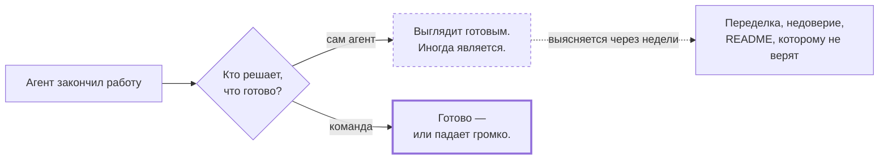
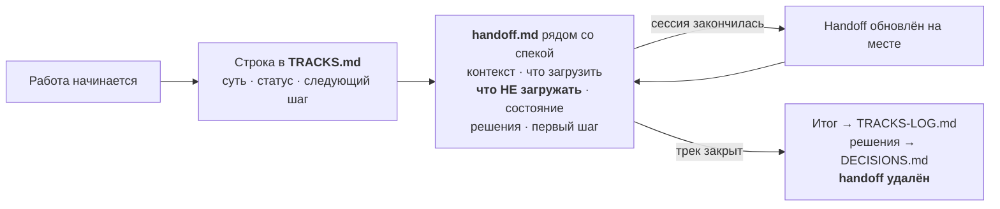

# Гайд на 15 минут

**Кому это?** Тому, кто решил попробовать.
**Когда читать?** Сейчас, сверху вниз, за один присест. Ещё выбираете — [зачем это](WHY.ru.md).
Уже что-то сломалось — [что делать](TROUBLESHOOTING.ru.md).

---

Что это, зачем оно вам и как получить зелёную проверку в своём репозитории. Читается
сверху вниз за один присест.


## 1. Зачем

Вы просите агента сделать фичу. Он пишет код, гоняет тест и рапортует об успехе. Шесть
таких отчётов правдивы. Седьмой выглядит точно так же и правдивым не является: тест ничего
не проверяет, документация описывает возможность, которой никогда не было, а в списке
задач стоит галочка, которую не к чему привязать.

Проблема не в модели. Проблема в том, что **«готово» решил тот, кто делал работу.**



Курс [Learn Harness Engineering](https://walkinglabs.github.io/learn-harness-engineering/ru/)
называет это «экстернализировать суждение о завершении»: современные модели систематически
сверх-уверены в собственной работе, поэтому судить о готовности должно что-то внешнее. Этот
инструмент — исполняемая версия того же принципа.

## 2. Идея одним предложением

**Каждое утверждение называет то, что его доказывает, а команда перепроверяет их все.**

Утверждение — это утверждение, где бы оно ни жило, поэтому все три их вида проходят через
один и тот же чекер:

| Где живёт утверждение | Что его доказывает |
|---|---|
| Фраза в документе | `<!-- proof: path/to/file.ts:<aSymbol> -->` |
| Галочка в списке задач | тот же маркер, на самой задаче |
| Пункт очереди работ | его команда верификации, перезапускаемая в CI |

## 3. Три минуты до зелёной проверки

=== "pnpm"

    ```bash
    pnpm add -D harnessimo
    pnpm exec harnessimo init
    pnpm exec harnessimo check
    ```

=== "npm"

    ```bash
    npm i -D harnessimo
    npx harnessimo init
    npx harnessimo check
    ```

=== "yarn"

    ```bash
    yarn add -D harnessimo
    yarn harnessimo init
    yarn harnessimo check
    ```

=== "bun"

    ```bash
    bun add -d harnessimo
    bunx harnessimo init
    bunx harnessimo check
    ```

Дальше в примерах пишется просто `harnessimo …` — подставьте свой запускатор: `pnpm exec`,
`npx`, `yarn` или `bunx`.

`init` сначала читает ваш репозиторий — чем запускаются команды, где исходники, есть ли
миграции и CI — и пишет конфиг, который уже проходит. Затем создаёт ровно три вещи:

```
.harness/            пять подсистем со стартовыми документами
  1-instructions/    ваши правила — перепишите, они лежат как примеры
  2-tools/           что проект умеет запускать
  3-environment/     как воспроизводится и что агенту трогать нельзя
  4-state/           PROGRESS.md, DECISIONS.md, очередь работ
  5-feedback/        карта ваших проверок
specs/               TRACKS.md (живая работа), шаблоны спеки и handoff
harnessimo.config.json  какие проверки вы включили
```

Скаффолд сразу проходит собственную проверку, поэтому первый зелёный прогон ничего не
стоит — а каждый красный после него что-то значит.

Дальше:

```bash
harnessimo doctor
```

Печатает, что реально включено, а что нет. **Секция, которую вы не указали в конфиге, —
это проверка, которая не работает, и `doctor` об этом говорит.** В этой честности весь
смысл: команда, верящая в несуществующую проверку, перестаёт искать недостающую.

## 4. Включайте то, что болит { #turn-on }

Не включайте все девять сразу. Возьмите ту, что отвечает реальной боли, добейтесь зелёного,
закоммитьте — потом следующую.

| Ваша боль | Включить | Падает, когда |
|---|---|---|
| README описывает то, чего уже нет | `docs` | файл, тест или команда из утверждения исчезли |
| Каждая сессия начинается заново | `tracks` | у трека нет статуса или ссылка на удалённый handoff |
| Галочки, которые не к чему привязать | `tracks.gateTasks` | отмеченная задача не называет проверку |
| «Готово», которое оказалось не готово | `queue` | пункт со статусом passing падает при перезапуске |
| Работает только на машине автора | `coldStart` | свежий клон не может себя проверить |
| Отладочный мусор, устаревший PROGRESS | `cleanExit` | сессия оставила мусор или ничего не записала |
| Файл инструкций разросся в мануал на 600 строк | `instructions` | он вышел за лимит строк |
| Агент правит то, что его оценивает | `locked` | коммит агента тронул эти пути |
| npm, теги и changelog рассказывают разное | `release` | у выпущенной версии нет тега или верхняя запись changelog — не то, что отгружается |

## 5. Как выглядит рабочая сессия

Ежедневный цикл после настройки. Две команды из пяти — это харнесс, остальное — обычная
работа.


Две вещи делают это рабочим, и обе принудительны, а не по договорённости:

- **Вы никогда не пишете `passing` сами.** Это делает только `harnessimo queue verify` и
  только после запуска команды самого пункта. Курс называет это «гейт по состоянию
  passing». CI перезапускает каждое такое утверждение, поэтому вручную выставленный статус
  обнаруживается, а не принимается на веру.
- **Один пункт за раз.** Рассеянное внимание рождает работу, начатую везде и не законченную
  нигде.

## 6. Незаконченная работа переживает конец сессии

Сессия закончилась — её память исчезла. Очередь говорит, *какой* пункт в работе; она не
говорит, где вы остановились, что уже пробовали и — самое ценное — что следующей сессии
читать **не надо**.



Индекс проверяется машиной, потому что **лживый handoff хуже, чем его отсутствие** —
следующая сессия ему верит. Строка без статуса или ссылка на удалённый handoff роняет гейт.

Раздел «что НЕ загружать» все пропускают — и именно он окупает всю практику: бюджет свежей
сессии уходит на то, что вы не отсекли заранее.

## 7. На каждом коммите

```bash
harnessimo hooks install
```

Создаёт `.githooks/pre-commit` и указывает на него git, чтобы быстрые проверки
отрабатывали до коммита, а не после четырёх минут CI.

Запускаются **только** секундные гейты. Перепроверка, холодный старт и ваши тесты
остаются в CI, где ожидание никому ничего не стоит: хук, замедляющий каждый коммит,
обходят через `--no-verify`, а обойдённый хук не защищает ничего. Если у проекта
есть своя быстрая команда — укажите её в конфиге, и хук выполнит её первой:

```jsonc
{ "hooks": { "before": ["npm run validate >/dev/null"] } }
```

`harnessimo hooks status` отвечает на вопрос, который никто не догадывается задать:
файл есть — а git его вообще использует? Ненастроенный хук выглядит ровно так же,
как проходящий.

## 7b. В CI

Одна джоба. Она запускает ту же команду, что и вы локально, поэтому спорить про «у меня
работает» не о чем:

```yaml
- run: npx harnessimo check --reverify
```

`--reverify` перезапускает каждый пункт, который claims passing. Именно эта строка
превращает evidence очереди в доказательство, а не в строку, которую кто-то напечатал.

Двум проверкам нужен диапазон коммитов, поэтому у них свой шаг:

```yaml
- run: npx harnessimo locked     "${{ github.event.pull_request.base.sha }}" HEAD
- run: npx harnessimo clean-exit "${{ github.event.pull_request.base.sha }}" HEAD
```


## 8. Внедрение в репозиторий, где уже есть свои проверки { #adopting }

Новый репозиторий — одна команда. Существующий — упражнение по переводу, и это
интересный случай.

### Новый репозиторий: пять шагов после §3

Установка и `init` — это §3 выше; здесь то, что делать со скаффолдом, который он написал.

Дальше по порядку:

1. **Перепишите `CONSTRAINTS.md` под реальные правила проекта.** Форму сохраните: правило,
   затем кто его ловит, затем зачем. Удалите все примеры, которых вы не приняли:
   ограничение-пожелание — это ложь с добрыми намерениями.
2. **Направьте `docs.commands` на ваш запускатор команд** — `{ "make": "Makefile" }`,
   `{ "task": "Taskfile.yml" }`, `{ "pnpm run": "package.json" }`. Без этого маркер
   `<!-- proof: make <цель> -->` не может быть разрешён и говорит об этом, а не проходит
   молча.
3. **Добавьте свой центральный документ в `docs.mustCarryProof`.** Обычно это `README.md`.
   Именно это делает строгий режим осмысленным.
4. **Встройте `harnessimo check` в CI** рядом с существующим гейтом.
5. **Поставьте оба хука.** `harnessimo hooks install` запускает быстрые гейты перед
   коммитом; `harnessimo hooks install --agent` выдаёт состояние харнеса каждой новой сессии
   агента на старте. Второй — это то, что превращает «сначала прочитай handoff» из правила,
   зависящего от памяти, в механизм.

### Существующий репозиторий

Правило на всю миграцию: **внедрение никогда не обменивается на потерю проверки.** Если общая
реализация не выражает то, что вы уже проверяете, оставьте свою проверку и запишите разрыв.
Молча потерять гейт ради аккуратной миграции — ровно тот провал, ради предотвращения которого
этот инструмент существует.

#### 1. Инвентаризация до того, как что-то удалять

Выпишите, что вы проверяете сегодня и чем именно. Затем запустите:

```bash
harnessimo doctor
```

и сравните построчно. `doctor` сообщает о том, что настроено, и никогда о том, что
задумывалось, — поэтому разница между двумя списками и есть настоящая работа.
<!-- proof: test/cli.test.ts#doctor reports what is enforced and what is not, without overstating -->

#### 2. Переводите по одной секции

Каждая секция `harnessimo.config.json` ложится на то, что у вас скорее всего уже есть:

| У вас есть | Становится |
|---|---|
| Скрипт со списком путей, которые агенту трогать нельзя | `locked.paths` + `locked.baseline` |
| Smoke-скрипт «склонировать и запустить» | `coldStart.requiredFiles` / `.commands` / `.entryDocs` |
| Список фич или очередь задач со статусами | `queue.file` |
| Индекс работ в процессе, который ведут руками | `tracks.file` плюс handoff на каждый трек |
| Скрипт аудита документации | `docs.roots`, `docs.mustCarryProof`, `docs.commands` |
| Самописный SessionStart-хук | `harnessimo hooks install --agent` |
| Самописный pre-commit хук | `harnessimo hooks install` + `hooks.before` |
| Grep по `TODO` / `console.log` на ревью | `cleanExit.markers` + `cleanExit.scan` |
| Просьба держать `AGENTS.md` коротким | `instructions.limits` |
| Релизный процесс, о расхождении которого никто не узнаёт | `release.manifest` + `release.changelog` |

Включите одну, запустите `harnessimo check`, почините найденное, закоммитьте. Потом
следующую. Миграция, которая включает шесть проверок разом, даёт один огромный красный
прогон, который никто не читает.

#### 3. Оставьте свою обёртку, если она есть

Репозиторию, чей гейт — задача в `Taskfile` или TypeScript-модуль с собственными юнит-тестами,
не нужно от этого отказываться. Оставьте обёртку и пусть она зовёт пакет: так у правила одна
реализация, а у проекта остаются своя точка входа и свои специфичные части:

```ts
import { verifyProofs, createResolver } from "harnessimo";
```
<!-- proof: src/index.ts -->

Признак удавшейся миграции — не исчезновение обёртки, а то, что *правило* существует в одном
экземпляре.

#### 4. Удаляйте копии тем же коммитом, что и переключение

Вендоренный скрипт, который больше не вызывают, хуже того, который вызывают: следующий
человек его правит, и ничего не происходит. Удалите его в коммите, который переключает, —
тогда дифф показывает обмен, а не накопление.

### Два разобранных примера

**`code-knowledge-base`** (Make, pnpm-воркспейс). Его харнес почти точно ложится на общий:
`locked-surfaces.sh` становится `locked.paths`, `cold-start.sh` — секцией `coldStart`,
`harness.ts` — `queue.file`. Он получает то, чего у него не было — proof-маркеры, треки работ,
гейт задач — ценой одного конфигурационного файла.

У его внедрения есть предусловие, которое стоит скопировать: сначала он был красным в CI по
постороннему поводу (скрипт переехал при реорганизации, а элемент очереди, который его
проверял, продолжал указывать на старый путь). **Почините CI до внедрения.** Иначе первый
красный прогон после миграции получается неоднозначным, а неоднозначный красный прогон
игнорируют.

**`ledger-lens`** (Taskfile, Next.js, Supabase, Python). У него уже были proof-маркеры, треки
и гейт задач в виде TypeScript с собственными юнит-тестами, поэтому его миграция — случай
«оставьте обёртку»: модуль делегирует пакету, а специфичный для проекта резолвер (префиксы
миграций Supabase, собственный список `MUST_CARRY_PROOF`) становится конфигурацией. Он
получает locked-поверхности и cold start, которых у него не было никогда.

### После внедрения

- Пиньте версию, которую внедрили: `harnessimo@0.5.4`, а не диапазон. Отслеживание последней
  означает, что правило может ужесточиться между двумя зелёными прогонами, — а это ровно тот
  сюрприз, которого гейт выдавать не должен.
- Запускайте `harnessimo doctor` в CI по расписанию или читайте перед каждым релизом. Это
  единственный ответ на вопрос «что этот репозиторий реально гарантирует».

## 9. Вопросы

Переехали, чтобы их находил и тот, кто не читает гайд сверху вниз:
[FAQ](FAQ.ru.md) — для вопросов, [что делать](TROUBLESHOOTING.ru.md) — для красного прогона.

## 10. Дальше

- [`STANDARD.md`](STANDARD.md) — обоснование каждого правила и лекция курса, из которой оно
  выросло.
- `harnessimo help` — все команды с аргументами.
