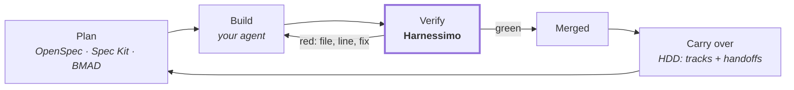

# What was taken from each system, and what was not

Six systems were read before any of this was written: OpenSpec, Agent OS, Spec Kit, BMAD,
handoff-driven development and plain TDD, plus the Learn Harness Engineering course the
vocabulary comes from. Each one organises how work gets done. **None of them re-checks the
claim that the work is finished** — and that is the only thing this package does.

So nothing here competes with them. Every rule below is one idea taken from one of those
systems and reduced to a command that exits non-zero, with the framework, the CLI, the
personas and the templates left behind.



## The map

| System | Taken | Left behind | Lives here as |
|---|---|---|---|
| [OpenSpec](https://github.com/Fission-AI/OpenSpec) | `specs/` is the current truth; one spec, one deliverable; archive after shipping | the CLI and its change/archive machinery | `tracks` + the `specs/` scaffold |
| [Agent OS](https://buildermethods.com/agent-os) | standards live apart from specs and are never copied into them | the document hierarchy, the role scaffolding | `instructions` + `.harness/1-instructions/` |
| [Spec Kit](https://github.com/github/spec-kit) | an acceptance criterion must be executable | the templates and slash-command bindings | `tasks` + `proof` |
| [BMAD](https://github.com/bmad-code-org/BMAD-METHOD) | verification is a step with its own artifact | the agent personas and prompts | `queue` |
| [HDD](https://github.com/yetanothervan/handoff-driven-development) | unfinished work crosses sessions in a written handoff | the as-built spec genres, the separate audit script | `tracks` + `brief` |
| TDD | the judgement about "works" belongs in something that exits non-zero | nothing — it is extended, not replaced | `queue` runs your tests |
| [Learn Harness Engineering](https://walkinglabs.github.io/learn-harness-engineering/ru/) | the five subsystems, and externalising the completion judgement | — it is the course this implements | `init`, `locked`, `cleanExit`, `coldStart` |

Everything below is the same table, one system at a time, with the file it lives in and the
commands you actually type.

---

## OpenSpec

**What it is.** Spec-driven development for AI assistants: a change gets a proposal, a spec
and a task list in its own folder, and the folder is archived once it ships. `specs/` is the
current truth about the system, not a pile of historical documents.

**Taken**

- one spec = one deliverable, in its own directory;
- `specs/` describes what is true now, and a shipped change leaves it rather than accreting;
- closing a piece of work is a distillation, not an append.

**Left behind**

- the CLI and its change/archive commands. A directory and a Markdown file do not need a
  binary, and a tool that owns your specs is a tool you have to keep alive;
- the proposal/solution document set. One `spec.md` with executable criteria carries it.

**Where it is implemented**

| Piece | File | Check | Config |
|---|---|---|---|
| The track index resolves and every track carries a status | `src/tracks.mjs` | `harnessimo tracks` | `tracks.file`, `tracks.log` |
| The `specs/` shape, the spec and handoff templates | `templates/specs/` | written by `init` | `tracks.specsDir` |

<!-- proof: src/tracks.mjs:checkTracks -->

**How to use it**

```bash
harnessimo init          # writes specs/TRACKS.md, TRACKS-LOG.md and the two templates
cp specs/spec.template.md specs/0004-retrieval/spec.md
harnessimo tracks        # the index must resolve and carry statuses
```

When the work ships, its outcome goes into `specs/TRACKS-LOG.md` in one or two sentences and
the track line disappears. Git keeps the rest — that is the archive.

---

## Agent OS

**What it is.** A way of capturing a team's standards — conventions, architectural
decisions — so they are injected into an agent's context instead of being re-explained in
every prompt, and kept separate from the specs they shape.

**Taken**

- standards and specs are different things and live in different places;
- a standard is referenced, never copied into a spec, so there is one copy to correct;
- the instruction file is a router to those documents, not the documents themselves.

**Left behind**

- the layered document hierarchy and the role scaffolding. The shape here is five
  directories from lecture 02, not a taxonomy of documents.

**Where it is implemented**

| Piece | File | Check | Config |
|---|---|---|---|
| The instruction file stays a router | `src/cleanexit.mjs` | `harnessimo instructions` | `instructions.limits` |
| Where the standards live | `templates/.harness/1-instructions/` | written by `init` | — |

<!-- proof: src/cleanexit.mjs:instructionProblems -->

**How to use it**

```json
{ "instructions": { "limits": { "AGENTS.md": 120, "CLAUDE.md": 120 } } }
```

```
$ harnessimo instructions
FAIL  instructions
  AGENTS.md  187 lines, limit 120
    fix:  move a section into a document and link it — lecture 04: what lands in
          the middle of a long instruction file is what gets ignored
```

The limit is the enforcement. A rule that says "keep it short" and never fails is a wish.

---

## Spec Kit — spec-driven development

**What it is.** GitHub's SDD toolkit: `/speckit.specify`, `/speckit.plan`, `/speckit.tasks`,
`/speckit.implement` turn an intent into a spec, a plan and a task list per feature.

**Taken** — one rule, and it is the most valuable idea in any of these systems:

> **an acceptance criterion must be executable** — a test name, an eval case, a query.

**Left behind**

- the 300-line templates and the slash-command bindings. Generate your specs with Spec Kit,
  with BMAD, or by hand; this does not care which.

**Where it is implemented**

| Piece | File | Check | Config |
|---|---|---|---|
| A ticked box must name a check that passes | `src/tasks.mjs` | `harnessimo tasks` | `tracks.gateTasks`, `tracks.taskFile` |
| A claim in a document must name its evidence | `src/proof.mjs` | `harnessimo proof` | `docs.roots`, `docs.commands` |

<!-- proof: src/tasks.mjs:verifyTaskGates -->

**How to use it**

Point the gate at whatever the generator produced:

```json
{
  "tracks": { "specsDir": "specs", "taskFile": "tasks.md", "gateTasks": true },
  "docs":   { "roots": ["docs", "specs"], "commands": { "npm run": "package.json" } }
}
```

Then a tick has to carry its evidence:

```markdown
- [x] T3 Retrieval returns only rows the caller may see
      <!-- proof: tests/<file>.spec.ts#<the test name> -->
```

```
FAIL  task gate
  specs/0004-retrieval/tasks.md:14  T3 is checked but names no proof
```

Only live tracks are gated, so adopting this does not require going back through every
finished spec.

---

## BMAD

**What it is.** An agile framework for AI-driven delivery: clarify → plan → build and
verify, worked through specialised perspectives (product, architecture, UX, development,
testing) that produce durable artifacts instead of chat.

**Taken**

- verification is a step with its own artifact, not a feeling at the end of a story;
- a unit of work is sized to be finished, and carries what would settle it.

**Left behind**

- the agent personas. No prompts ship in this package, and none are needed: the queue does
  not care who or what did the work.

**Where it is implemented**

| Piece | File | Check | Config |
|---|---|---|---|
| Only a passing command moves an item to `passing` | `src/queue.mjs` | `harnessimo queue verify <id>` | `queue.file` |
| Every passing claim is re-run | `src/queue.mjs` | `harnessimo check --reverify` | `queue.timeoutMinutes` |
| WIP limit and the review backlog | `src/readiness.mjs` | `harnessimo queue activate <id>` | `wip_limit` in the queue file |

<!-- proof: src/queue.mjs:verifyItem --> <!-- proof: src/readiness.mjs:readiness -->

**How to use it**

Each item is a story with the command that closes it:

```json
{
  "id": "rls-proof",
  "behavior": "A non-owner org receives zero rows from every table.",
  "verification": "npm test -- rls",
  "state": "not_started"
}
```

```bash
harnessimo queue status              # what is in flight, what is waiting
harnessimo queue verify rls-proof    # activates it, runs the command, records the outcome
harnessimo check --reverify          # CI re-runs every item claiming to pass
```

The agent never writes `state` itself. That is the whole point of the section: editing it by
hand is not a shortcut, it is the thing `--reverify` catches.

---

## HDD — handoff-driven development

**What it is.** A session ends and its memory is gone, so unfinished work crosses that
boundary in a written handoff rather than in someone's head.

**Taken**

- a live track index, one line per track: essence, handoff link, status, next step;
- a `handoff.md` next to the spec: context, what to load **and what not to**, state,
  decisions taken, first step — edited in place, never appended to;
- closing a track distils the outcome into a log and deletes the handoff.

**Left behind**

- the as-built spec genres and the separate audit script. The audit is a check inside the
  same gate everything else runs through, so there is one command, not two.

**Where it is implemented**

| Piece | File | Check | Config |
|---|---|---|---|
| A dead handoff link, or a track with no status, fails | `src/tracks.mjs` | `harnessimo tracks` | `tracks.file` |
| The next session is handed the state at startup | `src/brief.mjs` | `harnessimo brief` | — |
| The hook that runs it without anyone remembering | `src/hooks.mjs` | `harnessimo hooks install --agent` | — |

<!-- proof: src/tracks.mjs:checkHandoffRefs --> <!-- proof: src/brief.mjs:briefText -->

**How to use it**

```bash
harnessimo hooks install --agent   # merges a SessionStart hook into .claude/settings.json
harnessimo brief                   # the same output, on demand
```

```
== specs/TRACKS.md (live work tracks — load a track's handoff first) ==
- Retrieval quality — [handoff](specs/0004-retrieval/handoff.md) — active, next: T3 recall eval
- Hosted deploy — none — blocked (on an API token)
```

A handoff nobody reads is a diary. A handoff pushed into the session's first turn is a
protocol — which is why the delivery half matters as much as the check.

---

## TDD

**What it is.** The oldest version of the same principle: the judgement about "works" is
externalised into something that exits non-zero, and it is written before the code.

**Taken** — the principle, extended to the three places tests do not reach: documentation
(`proof`), task lists (`tasks`) and workflow state (`queue`).

**Left behind** — nothing. If your tests are good, the queue costs one line of JSON per item,
because the command it runs is the test you already have.

**How to use it**

```json
{ "id": "invoice-totals", "verification": "npm test -- invoices", "state": "not_started" }
```

That is the whole integration. The value added is not another test framework: it is that the
result is written down by the tool and re-run later, so "it passed in March" cannot stand in
for "it passes now".

---

## Learn Harness Engineering

**What it is.** The course this implements, and where the vocabulary comes from: a harness is
everything in the engineering infrastructure outside the model's weights.

**Taken**

- the five subsystems — instructions, tools, environment, state, feedback — as the directory
  layout `init` writes;
- externalising the completion judgement (lecture 09);
- the reward-hacking failure: a system that can edit its own scoring will;
- a clean session exit (lecture 12) and the instruction-file limit (lecture 04).

**Where it is implemented**

| Piece | File | Check | Config |
|---|---|---|---|
| The five directories, with starter documents | `templates/.harness/` | written by `init` | — |
| The scoring surfaces are out of an agent's reach | `src/locked.mjs` | `harnessimo locked` | `locked.paths`, `locked.baseline` |
| No debris, and progress written down | `src/cleanexit.mjs` | `harnessimo clean-exit` | `cleanExit.*` |
| A fresh clone runs from the repository alone | `src/coldstart.mjs` | `harnessimo cold-start` | `coldStart.commands` |

<!-- proof: src/locked.mjs:lockedViolations --> <!-- proof: src/coldstart.mjs:coldStartProblems -->

**How to use it**

```bash
harnessimo init      # the five directories and the starter documents
harnessimo doctor    # which of the checks are on, and which are not
```

[The standard](STANDARD.md) says which lecture each rule comes from, and where this
implementation makes a choice the course leaves open.

---

## What none of them gave: documentation that cannot lie

Every system above produces documents. None of them re-checks that the documents are still
true, and the failure this package was written for was exactly that: a README describing
infrastructure that had never been built.

So the proof marker is the one part that is not borrowed. A claim names its evidence, and the
build resolves it:

```markdown
Metrics are reconciled against the provider's own total. <!-- proof: docs/<your-doc>.md -->
Run it with `make verify`. <!-- proof: make <target> -->
```

```
FAIL  proof markers
  README.md:31  docs/RECONCILIATION.md
      no such file
```

Implemented in `src/proof.mjs`, run by `harnessimo proof`, configured under `docs`.
`docs.mustCarryProof` names the documents that must carry at least one marker, so a rewrite
cannot quietly drop the evidence along with the claim.
<!-- proof: src/proof.mjs:verifyProofs -->

---

## What this does not decide for you

No personas, no prompt templates, no opinion on how a spec should be written or how big a
story should be. There is no runtime, no daemon and no dependency. The rules are plain
functions over strings; `src/resolver.mjs` and `bin/harnessimo.mjs` are the only files that
touch the disk.

Pick the system you like from the list above. This is the part that tells you the truth about
it afterwards.

---

Next: [use cases and what it looks like in practice](USE-CASES.md) ·
[why each rule exists](STANDARD.md) · [adopting it in an existing repo](ADOPTING.md)
