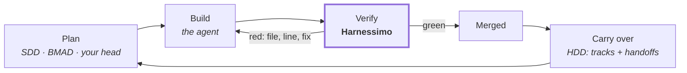

# Where it fits: SDD, HDD, BMAD

Every method here answers **how work is organised**. None of them answers **who checked that
the thing claimed to be done actually is**. That second question is the only one Harnessimo
answers, which is why it sits under all of them rather than competing with any.



| Method | What it gives you | Where the claim stays unchecked | The check that closes it |
|---|---|---|---|
| **SDD** — spec-driven development | A spec is the source of truth; the agent implements from it | The acceptance criteria are prose. Nothing re-runs them, and the spec drifts from the code | `proof` · `tasks` |
| **HDD** — handoff-driven development | Context survives the end of a session | A handoff goes stale, or points at files that were deleted three sessions ago | `tracks` |
| **BMAD-METHOD** | Clarify → plan → build and verify, with specialised agent perspectives and durable artifacts | "Verify" is a phase an agent performs and reports on | `queue` · `proof` |
| **TDD** | The test is the contract, written first | Covers code only — documents, task lists and "done" flags are outside it | `proof` · `tasks` · `queue` |
| **Issue trackers, Kanban** | Who is doing what, and WIP limits | A ticket records intent. Moving a card is not evidence | `queue` |

## SDD — spec-driven development

The idea: write the specification first, make it precise enough to build from, and let the
agent implement it. [GitHub's Spec Kit](https://github.com/github/spec-kit) is the best-known
toolkit for it — `/speckit.specify`, `/speckit.plan`, `/speckit.tasks`, `/speckit.implement`
turn an intent into a spec, a plan and a task list per feature.

What it does not do is re-run anything. A task list is a list of ticked boxes; a spec is
prose. Both are claims.

Point the task gate at whatever the generator produced, and a tick has to name evidence:

```json
{
  "tracks": {
    "file": "specs/TRACKS.md",
    "specsDir": "specs",
    "taskFile": "tasks.md",
    "gateTasks": true
  }
}
```

Now this fails:

```markdown
- [x] T3 Retrieval returns only rows the caller may see
```

```
FAIL  task gate
  specs/0004-retrieval/tasks.md:14  T3 is checked but names no proof
    fix:  name the test that proves it,
          <!-- proof: tests/<file>.spec.ts#<the test name> -->
```

The acceptance criterion in the spec and the check in CI become the same sentence. That is
the whole trick — and it is why the rule in this repository's own contract is *"a criterion
that cannot run does not exist"*. <!-- proof: src/tasks.mjs:checkTaskGate -->

## HDD — handoff-driven development

The idea: a session ends and its memory is gone, so unfinished work crosses that boundary in
a written handoff rather than in someone's head.
([handoff-driven-development](https://github.com/yetanothervan/handoff-driven-development)
is where the term comes from; `specs/TRACKS.md` here is the same shape.)

Harnessimo does two things for it. It **checks** the index — a track with no status, or a
link to a handoff that no longer exists, fails — and it **delivers** it: the SessionStart
hook prints the tracks, the head of each handoff and what is in flight, so the next session
starts from the handoff instead of re-deriving it.

```bash
harnessimo hooks install --agent   # writes .claude/hooks/ and merges .claude/settings.json
```

A handoff that nobody reads is a diary. A handoff pushed into the session's first turn is a
protocol. <!-- proof: src/brief.mjs:briefText -->

## BMAD-METHOD

[BMAD](https://github.com/bmad-code-org/BMAD-METHOD) organises the whole delivery loop —
clarify, plan, build and verify — around specialised agent perspectives (product,
architecture, UX, development, testing) and the durable artifacts they produce. It is
strongest exactly where Harnessimo is silent: deciding *what* to build and breaking it down.

Its "verify" step is performed by an agent and reported by an agent. Give that step an
external arbiter and the loop closes:

- each story or task gets a `verification` command in the queue;
- `harnessimo queue verify <id>` runs it and writes the outcome — the agent never writes
  `passing` itself;
- CI runs `check --reverify`, so a state edited by hand is caught rather than trusted.

Use BMAD to decide and plan. Use this to decide when planning turned into shipped work.

## TDD

The oldest version of the same principle: the judgement about "works" is externalised into
something that exits non-zero. Harnessimo does not replace it — it extends the same rule to
the three places tests do not reach: **documentation** (`proof`), **task lists** (`tasks`)
and **workflow state** (`queue`).

If your tests are good, `queue` costs you one line of JSON per item, because the command it
runs is the test you already have.

## Lineage: what was taken from each, and what was left

None of this was invented here. The checks are what survived from six methods after the
parts that need a runtime, a persona or a 300-line template were dropped — because a harness
that needs its own framework installed is one more thing to keep alive.

| Source | What this implements | What it deliberately leaves out |
|---|---|---|
| [OpenSpec](https://github.com/Fission-AI/OpenSpec) | `specs/` as the current truth: one spec, one deliverable, archived after it ships. `init` scaffolds it; `tracks` keeps the index honest | the CLI and its change/archive machinery — a directory and a Markdown file need no binary |
| [Agent OS](https://buildermethods.com/agent-os) | standards live apart from the specs and are never copied into them; the instruction file stays a router, and `instructions` enforces that with a line limit | the layered document hierarchy and the role scaffolding |
| [Spec Kit](https://github.com/github/spec-kit) | the one rule worth keeping: **an acceptance criterion must be executable** — a test name, an eval case, a query. `tasks` refuses a tick that names none | the long templates and the slash-command bindings. Generate your specs however you like |
| [BMAD](https://github.com/bmad-code-org/BMAD-METHOD) | that verification is a step with its own artifact: a queue item is a story carrying the command that settles it | the agent personas. No prompts ship in this package |
| SDD | the lane contract — a spec directory whose acceptance criteria are the commands that have to pass, code and spec shipping together | the ceremony around it: proposal documents, solution documents, a change-management CLI |
| [HDD](https://github.com/yetanothervan/handoff-driven-development) | tracks and handoffs, plus the rule that closing a track distils the outcome and deletes the handoff. `tracks` checks it, `brief` delivers it | the as-built spec genres and the separate audit script — the audit is a check inside the same gate |
| [Learn Harness Engineering](https://walkinglabs.github.io/learn-harness-engineering/ru/) | the five-subsystem model `init` scaffolds, the vocabulary, and the principle underneath all of it: externalise the judgement about completion | nothing — it is the course this implements. [The standard](STANDARD.md) says which lecture each check comes from |

And the one part that is not borrowed: **documentation verified by the build**. A claim names
its evidence, and evidence that goes stale fails the gate. Every method above produces
documents; none of them re-checks that the documents are still true.
<!-- proof: src/proof.mjs:verifyProofs -->

## What this does not decide for you

No personas, no prompt templates, no opinion on how a spec should be written or how big a
story should be. There is no runtime, no daemon and no dependency. The rules are plain
functions over strings, and the CLI is the only thing that touches the disk.

Pick the method you like. This is the part that tells you the truth about it afterwards.

---

Next: [use cases and what it looks like in practice](USE-CASES.md) ·
[why each rule exists](STANDARD.md)
