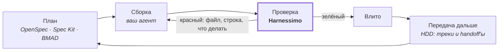

# SDD

**Кому это?** Тому, кто знает OpenSpec, Spec Kit, BMAD или Agent OS и хочет понять связь.
**Когда читать?** При сравнении или если вы уже пользуетесь одной из них и думаете, что это добавит.

---

**Spec-driven development и то, что взято из каждой системы, построенной вокруг него.**

Перед тем как что-либо здесь было написано, прочитаны шесть систем: OpenSpec, Agent OS,
Spec Kit и BMAD со стороны SDD, handoff-driven development и обычный TDD рядом с ними, плюс
курс Learn Harness Engineering, откуда взят словарь. Каждая организует то, как делается
работа. **Ни одна не перепроверяет утверждение о том, что работа закончена** — а это
единственное, чем занимается этот пакет.

Поэтому он ни с одной из них не конкурирует. Каждое правило ниже — это одна идея, взятая из
одной из этих систем и сведённая к команде, возвращающей ненулевой код, с оставленными за
бортом фреймворком, CLI, персонами и шаблонами.



## Карта

| Система | Взято | Оставлено за бортом | Живёт здесь как |
|---|---|---|---|
| [OpenSpec](https://github.com/Fission-AI/OpenSpec) | `specs/` — текущая правда; одна спека, один результат; архив после поставки | CLI и его change/archive-машинерия | `tracks` + скаффолд `specs/` |
| [Agent OS](https://buildermethods.com/agent-os) | стандарты живут отдельно от спек и не копируются в них | иерархия документов, role-scaffolding | `instructions` + `.harness/1-instructions/` |
| [Spec Kit](https://github.com/github/spec-kit) | критерий приёмки обязан быть исполняемым | шаблоны и привязки к слэш-командам | `tasks` + `proof` |
| [BMAD](https://github.com/bmad-code-org/BMAD-METHOD) | верификация — шаг со своим артефактом | персоны-агенты и промпты | `queue` |
| [HDD](https://github.com/yetanothervan/handoff-driven-development) | незаконченная работа переходит между сессиями письменным handoff'ом | жанры as-built спек, отдельный скрипт аудита | `tracks` + `brief` |
| TDD | суждение о «работает» принадлежит тому, что возвращает ненулевой код | ничего — принцип расширен, а не заменён | `queue` запускает ваши тесты |
| [Learn Harness Engineering](https://walkinglabs.github.io/learn-harness-engineering/ru/) | пять подсистем и экстернализация суждения о завершении | — это курс, который здесь реализован | `init`, `locked`, `cleanExit`, `coldStart` |

Дальше — та же таблица по одной системе за раз, с файлом, в котором это живёт, и командами,
которые вы реально набираете.

---

## OpenSpec

**Что это.** Spec-driven development для ИИ-ассистентов: изменение получает предложение,
спеку и список задач в собственной папке, а папка архивируется после поставки. `specs/` — это
текущая правда о системе, а не куча исторических документов.

**Взято**

- одна спека = один результат, в собственном каталоге;
- `specs/` описывает то, что верно сейчас, и поставленное изменение его покидает, а не
  накапливается в нём;
- закрытие работы — это дистилляция, а не дописывание.

**Оставлено за бортом**

- CLI с командами change/archive. Каталогу и markdown-файлу не нужен бинарник, а инструмент,
  который владеет вашими спеками, — это инструмент, который приходится поддерживать живым;
- набор документов «предложение/решение». Одна `spec.md` с исполняемыми критериями его
  заменяет.

**Где реализовано**

| Кусок | Файл | Проверка | Конфиг |
|---|---|---|---|
| Индекс треков разрешается, и каждый трек несёт статус | `src/tracks.ts` | `harnessimo tracks` | `tracks.file`, `tracks.log` |
| Форма `specs/`, шаблоны спеки и handoff'а | `templates/specs/` | пишет `init` | `tracks.specsDir` |

<!-- proof: src/tracks.ts:checkTracks -->

**Как пользоваться**

```bash
harnessimo init          # пишет specs/TRACKS.md, TRACKS-LOG.md и два шаблона
cp specs/spec.template.md specs/0007-checkout/spec.md
harnessimo tracks        # индекс обязан разрешаться и нести статусы
```

Когда работа поставлена, её итог одним-двумя предложениями уходит в `specs/TRACKS-LOG.md`, а
строка трека исчезает. Остальное хранит git — это и есть архив.

---

## Agent OS

**Что это.** Способ зафиксировать стандарты команды — соглашения, архитектурные решения —
так, чтобы они попадали в контекст агента, а не переобъяснялись в каждом промпте, и хранились
отдельно от спек, которые они формируют.

**Взято**

- стандарты и спеки — разные вещи и живут в разных местах;
- на стандарт ссылаются, его никогда не копируют в спеку: копия для исправления одна;
- файл инструкций — роутер к этим документам, а не сами документы.

**Оставлено за бортом**

- многоуровневая иерархия документов и role-scaffolding. Форма здесь — пять каталогов из
  лекции 02, а не таксономия документов.

**Где реализовано**

| Кусок | Файл | Проверка | Конфиг |
|---|---|---|---|
| Файл инструкций остаётся роутером | `src/cleanexit.ts` | `harnessimo instructions` | `instructions.limits` |
| Где живут стандарты | `templates/.harness/1-instructions/` | пишет `init` | — |

<!-- proof: src/cleanexit.ts:instructionProblems -->

**Как пользоваться**

```json
{ "instructions": { "limits": { "AGENTS.md": 120, "CLAUDE.md": 120 } } }
```

```
$ harnessimo instructions
FAIL  instructions
  AGENTS.md  187 lines, limit 120
    fix:  move a section into a document and link it — lecture 04: what lands in
          the middle of a long instruction file is what gets ignored
```

Принуждение — это лимит. Правило «держите покороче», которое никогда не падает, — пожелание.

---

## Spec Kit — spec-driven development

**Что это.** SDD-инструментарий GitHub: `/speckit.specify`, `/speckit.plan`,
`/speckit.tasks`, `/speckit.implement` превращают намерение в спеку, план и список задач на
каждую фичу.

**Взято** — одно правило, и это самая ценная идея из всех этих систем:

> **критерий приёмки обязан быть исполняемым** — имя теста, кейс эвала, запрос.

**Оставлено за бортом**

- 300-строчные шаблоны и привязки к слэш-командам. Генерируйте спеки Spec Kit'ом, BMAD'ом или
  руками — этому пакету всё равно.

**Где реализовано**

| Кусок | Файл | Проверка | Конфиг |
|---|---|---|---|
| Отмеченная галочка обязана называть проходящую проверку | `src/tasks.ts` | `harnessimo tasks` | `tracks.gateTasks`, `tracks.taskFile` |
| Утверждение в документе обязано называть доказательство | `src/proof.ts` | `harnessimo proof` | `docs.roots`, `docs.commands` |

<!-- proof: src/tasks.ts:verifyTaskGates -->

**Как пользоваться**

Направьте гейт на то, что сгенерировал ваш инструмент:

```json
{
  "tracks": { "specsDir": "specs", "taskFile": "tasks.md", "gateTasks": true },
  "docs":   { "roots": ["docs", "specs"], "commands": { "npm run": "package.json" } }
}
```

И тогда галочка обязана нести доказательство:

```markdown
- [x] T3 Суммы округляются по валюте, а не по строке
      <!-- proof: tests/<файл>.spec.ts#<имя теста> -->
```

```
FAIL  task gate
  specs/0007-checkout/tasks.md:14  T3 is checked but names no proof
```

Гейтятся только живые треки, поэтому внедрение не требует возвращаться ко всем законченным
спекам.

---

## BMAD

**Что это.** Agile-фреймворк для разработки с ИИ: прояснить → спланировать → собрать и
проверить, через специализированные перспективы (продукт, архитектура, UX, разработка,
тестирование), которые производят долговечные артефакты вместо переписки.

**Взято**

- верификация — это шаг со своим артефактом, а не ощущение в конце истории;
- единица работы имеет размер, при котором её можно закончить, и несёт то, что её закроет.

**Оставлено за бортом**

- персоны-агенты. В этом пакете не поставляется ни одного промпта, и они не нужны: очереди
  всё равно, кто или что сделало работу.

**Где реализовано**

| Кусок | Файл | Проверка | Конфиг |
|---|---|---|---|
| В `passing` элемент переводит только прошедшая команда | `src/queue.ts` | `harnessimo queue verify <id>` | `queue.file` |
| Каждое утверждение о прохождении перезапускается | `src/queue.ts` | `harnessimo check --reverify` | `queue.timeoutMinutes` |
| Лимит WIP и очередь на ревью | `src/readiness.ts` | `harnessimo queue activate <id>` | `wip_limit` в файле очереди |

<!-- proof: src/queue.ts:verifyItem --> <!-- proof: src/readiness.ts:readiness -->

**Как пользоваться**

Каждый элемент — это история с командой, которая её закрывает:

```json
{
  "id": "checkout-totals",
  "behavior": "An order total matches the sum of its lines, in every currency.",
  "verification": "npm test -- checkout",
  "state": "not_started"
}
```

```bash
harnessimo queue status                    # что в работе, что ждёт
harnessimo queue verify checkout-totals    # активирует, запускает команду, записывает результат
harnessimo check --reverify                # CI перезапускает каждый элемент, заявляющий прохождение
```

Агент никогда не пишет `state` сам. В этом весь смысл секции: правка руками — не короткий
путь, а именно то, что ловит `--reverify`.

---

## HDD — handoff-driven development

**Что это.** Сессия кончается, и её память исчезает, поэтому незаконченная работа переходит
эту границу письменным handoff'ом, а не в чьей-то голове.

**Взято**

- индекс живых треков, по строке на трек: суть, ссылка на handoff, статус, следующий шаг;
- `handoff.md` рядом со спекой: контекст, что загрузить **и чего не загружать**, состояние,
  принятые решения, первый шаг — правится на месте, никогда не дописывается;
- закрытие трека дистиллирует итог в журнал и удаляет handoff.

**Оставлено за бортом**

- жанры as-built спек и отдельный скрипт аудита. Аудит здесь — проверка внутри того же гейта,
  через который проходит всё остальное, поэтому команда одна, а не две.

**Где реализовано**

| Кусок | Файл | Проверка | Конфиг |
|---|---|---|---|
| Мёртвая ссылка на handoff или трек без статуса роняют гейт | `src/tracks.ts` | `harnessimo tracks` | `tracks.file` |
| Следующей сессии состояние выдают на старте | `src/brief.ts` | `harnessimo brief` | — |
| Хук, который делает это без чьей-либо памяти | `src/hooks.ts` | `harnessimo hooks install --agent` | — |

<!-- proof: src/tracks.ts:checkHandoffRefs --> <!-- proof: src/brief.ts:briefText -->

**Как пользоваться**

```bash
harnessimo hooks install --agent   # вносит SessionStart-хук в .claude/settings.json
harnessimo brief                   # тот же вывод, по требованию
```

```
== specs/TRACKS.md (live work tracks — load a track's handoff first) ==
- Checkout totals — [handoff](specs/0007-checkout/handoff.md) — active, next: T3 currency rounding
- Hosted deploy — none — blocked (on an API token)
```

Handoff, который никто не читает, — это дневник. Handoff, вложенный в первый ход сессии, —
это протокол; поэтому доставка здесь важна ровно настолько же, насколько проверка.

---

## TDD

**Что это.** Самая старая версия того же принципа: суждение о «работает» вынесено в то, что
возвращает ненулевой код, и написано до кода.

**Взято** — принцип, расширенный на три места, куда тесты не достают: документация (`proof`),
списки задач (`tasks`) и состояние процесса (`queue`).

**Оставлено за бортом** — ничего. Если тесты у вас хорошие, очередь стоит одной строки JSON на
элемент, потому что запускает она тот тест, который у вас уже есть.

**Как пользоваться**

```json
{ "id": "cart-merge", "verification": "npm test -- cart", "state": "not_started" }
```

Это вся интеграция. Добавленная ценность не в ещё одном тестовом фреймворке, а в том, что
результат записывает инструмент и перезапускает потом, — так что «прошло в марте» не может
подменить «проходит сейчас».

---

## Learn Harness Engineering

**Что это.** Курс, который здесь реализован, и источник словаря: харнес — это всё в
инженерной инфраструктуре за пределами весов модели.

**Взято**

- пять подсистем — инструкции, инструменты, среда, состояние, обратная связь — как раскладка
  каталогов, которую пишет `init`;
- экстернализация суждения о завершении (лекция 09);
- провал с reward hacking: система, способная править собственную оценку, будет это делать;
- чистый выход из сессии (лекция 12) и лимит на файл инструкций (лекция 04).

**Где реализовано**

| Кусок | Файл | Проверка | Конфиг |
|---|---|---|---|
| Пять каталогов со стартовыми документами | `templates/.harness/` | пишет `init` | — |
| Поверхности оценки вне досягаемости агента | `src/locked.ts` | `harnessimo locked` | `locked.paths`, `locked.baseline` |
| Ни мусора, ни незаписанного прогресса | `src/cleanexit.ts` | `harnessimo clean-exit` | `cleanExit.*` |
| Свежий клон запускается из одного репозитория | `src/coldstart.ts` | `harnessimo cold-start` | `coldStart.commands` |

<!-- proof: src/locked.ts:lockedViolations --> <!-- proof: src/coldstart.ts:coldStartProblems -->

**Как пользоваться**

```bash
harnessimo init      # пять каталогов и стартовые документы
harnessimo doctor    # какие проверки включены, а какие нет
```

[Стандарт](STANDARD.md) говорит, из какой лекции взято каждое правило и где эта реализация
делает выбор, который курс оставляет открытым.

---

## Чего не дала ни одна: документация, которая не может врать

Все системы выше производят документы. Ни одна не перепроверяет, что документы всё ещё
правдивы, — а провал, ради которого писался этот пакет, был ровно таким: README, описывающий
инфраструктуру, которую никогда не строили.

Поэтому proof-маркер — единственная незаимствованная часть. Утверждение называет своё
доказательство, а сборка его разрешает:

```markdown
Суммы округляются по валюте, а не по строке.   <!-- proof: docs/<файл>.md -->
Проверить самому: `make verify`.               <!-- proof: make <цель> -->
```

```
FAIL  proof markers
  README.md:31  docs/ARCHITECTURE.md
      no such file
```

Реализовано в `src/proof.ts`, запускается `harnessimo proof`, настраивается в секции `docs`.
`docs.mustCarryProof` называет документы, обязанные нести хотя бы один маркер, — чтобы
переписывание не могло тихо выбросить доказательство вместе с утверждением.
<!-- proof: src/proof.ts:verifyProofs -->

---

## Чего он за вас не решает

Ни персон, ни шаблонов промптов, ни мнения о том, как писать спеку и какого размера должна
быть история. Ни рантайма, ни демона, ни зависимостей. Правила — обычные функции над
строками; `src/resolver.ts` и `src/cli.ts` — единственные файлы, которые трогают диск.

Выберите из списка выше систему, которая вам нравится. Этот инструмент — та часть, которая
потом говорит о ней правду.

---

Дальше: [сценарии и как это выглядит на практике](REFERENCE.md) ·
[почему существует каждое правило](STANDARD.md) ·
[внедрение в существующий репозиторий](GUIDE.ru.md#adopting)
