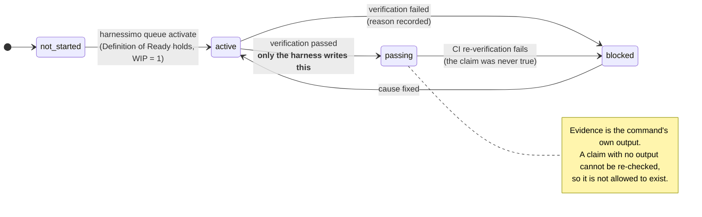
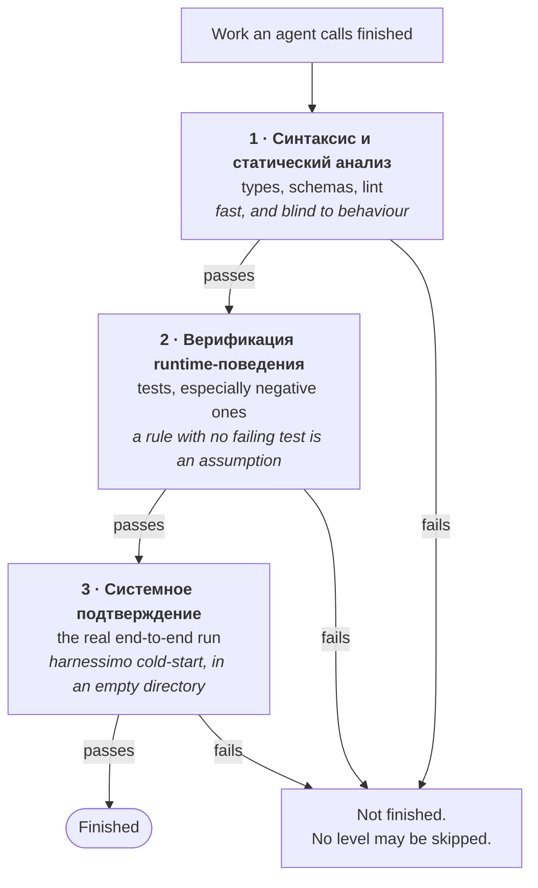
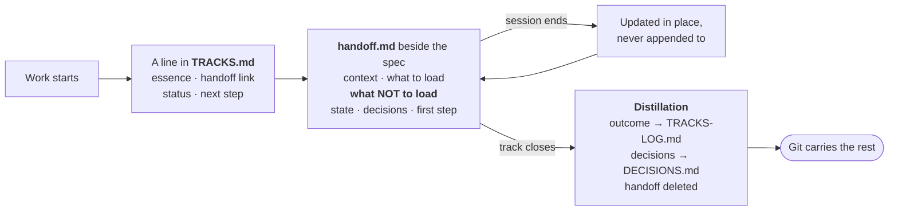

# The standard

What a harness is, what the parts are for, and why each rule here exists. The tool is the
enforcement; this is the thing being enforced.

The model and its vocabulary come from
[**Learn Harness Engineering**](https://walkinglabs.github.io/learn-harness-engineering/ru/).
This document does not restate the course — it says which of its ideas are implemented here,
how, and where this implementation makes a choice the course leaves open.

## The claim

A harness is *«всё в инженерной инфраструктуре за пределами весов модели»* — everything in
the engineering infrastructure outside the model's weights
([lecture 02](https://walkinglabs.github.io/learn-harness-engineering/ru/lectures/lecture-02-what-a-harness-actually-is/)).
Infrastructure decides which of a model's capabilities actually show up in practice.

The failure mode is specific. A capable model rarely fails by producing obvious nonsense.
It fails by **declaring victory**: a documented capability nobody built, a ticked box nobody
re-ran, a test suite that quietly stopped asserting anything. Each is invisible to a reader
and visible to a command — which is the whole opening.

So the design principle is: **move every judgement about "done" out of prose and into
something that exits non-zero.** Lecture 09 calls this *«экстернализировать суждение о
завершении»* — externalising the completion judgement — on the grounds that
*«современные нейронные сети систематически сверх-уверены»*.
<!-- proof: src/queue.ts:checkQueue -->

## Where each check comes from

| Lecture | Idea | Implemented as |
|---|---|---|
| 02 · what a harness is | five subsystems, kitchen metaphor | the `.harness/` layout |
| 03 · repository as source of truth | nothing outside the repo exists | `harnessimo proof`, `harnessimo cold-start` |
| 04 · one giant instruction file fails | instructions are a router | `harnessimo instructions` |
| 05 · continuity between sessions | PROGRESS, DECISIONS, session protocol | `.harness/4-state/`, `harnessimo tracks` |
| 06 · initialization as its own phase | a scaffolded start | `harnessimo init` |
| 05 · continuity between sessions | state handed over, not looked up | `harnessimo brief`, the SessionStart hook |
| 07 · overreach and under-finishing | WIP = 1, scope belongs to the human | `harnessimo queue activate` |
| 08 · feature lists as primitives | behaviour + verification + state | `harnessimo queue` |
| 09 · declaring victory too early | the passing-state gate, evidence | `harnessimo queue verify`, `--reverify` |
| 10 · end-to-end as ground truth | the real run is the proof | `harnessimo cold-start` |
| 12 · clean state at session end | no debris, progress written down | `harnessimo clean-exit` |

Two things here are **not** from the course: proof markers and handoff-driven development.
Both came out of production repositories and are described in their own sections below.

## Layer 1 — Instructions *(«подсистема инструкций» — the recipe shelf)*

Deliberately short. A long instruction file eats the working memory it is trying to direct,
and what lands in the middle is what gets ignored — the argument of
[lecture 04](https://walkinglabs.github.io/learn-harness-engineering/ru/lectures/lecture-04-why-one-giant-instruction-file-fails/).
The entry file is a router: what the project is, how to run it, how to check it, and links
to topical documents.

The only way a router stays a router is if something fails when it stops being one, so the
line limit is a check rather than a note. <!-- proof: src/cleanexit.ts:instructionProblems -->

The rule that makes this layer worth having is **labelling**: every constraint states
whether a command fails on it, or whether it is caught in review. In this repository four of
nine are review-only, and they say so.

**Why labelling matters more than the rules:** claiming enforcement that does not exist is
worse than claiming none, because a team that believes a check exists stops looking for the
missing one. Two of the repositories this came from had a constraints file asserting
"enforced by CI" at a time when CI had never run once — in one case because the workflow
triggered on `main` while the branch was still called `master`.

The Definition of Ready and the Definition of Done live here, referenced and never copied.
The decidable parts are enforced at the two moments they matter: when an item is started,
and when it is closed. <!-- proof: src/readiness.ts:readiness -->

## Layer 2 — Tools *(«подсистема инструментов» — the knife rack)*

One command surface, and the queue is a *command*, not a file you edit.

[Lecture 08](https://walkinglabs.github.io/learn-harness-engineering/ru/lectures/lecture-08-why-feature-lists-are-harness-primitives/)
calls the feature list *«позвоночник harness'а»* — the backbone — and prescribes the triple:
a behaviour, a command that verifies it, and a state. Its central rule is that
*«агент не может напрямую перевести фичу в `passing`»*: only the harness may, and only after
the verification command succeeds.

Two details that only appear once this runs in anger:

- **Verification runs with stdin closed and a hard timeout.** A command that stops to ask a
  question would otherwise block forever, and a loop that can hang silently has no stop
  condition. A harness without a stop condition is not a harness.
- **Nested calls degrade.** An item whose verification invokes the harness would recurse
  until killed, so a nested run checks invariants only.
  <!-- proof: src/cli.ts:HARNESS_REVERIFY -->

## Layer 3 — Environment *(«подсистема среды» — the stove)*

Reproducibility, so that "works here" and "works anywhere" are the same statement: a pinned
runtime, a lockfile, and an honest list of services.

Then the part the course leaves implicit and production makes urgent: **locked surfaces.** A
system that improves itself will, given the opportunity, improve its own score instead of
its own work. Every documented reward hack broke this invariant — the agent edited or
removed the instrumentation its checker depended on. So the files defining the acceptance
signal are placed out of the loop's reach, and the reach is enforced by a command rather
than an instruction, because instructions get optimised away.
<!-- proof: src/locked.ts:lockedViolations -->

The baseline exists because the commit that creates a protected file necessarily touches it.
Moving it forward widens what the system may change, which is a human decision.

**The limit is part of the design, not an omission:** this assumes commits pass through CI.
It is drift detection. An agent with push access that strips its own trailer defeats it.

## Layer 4 — State *(«подсистема состояния» — the prep table)*

A session ends and its memory is gone.
[Lecture 05](https://walkinglabs.github.io/learn-harness-engineering/ru/lectures/lecture-05-why-long-running-tasks-lose-continuity/)
puts it as treating the agent as *«гениальный инженер с амнезией»* — a brilliant engineer
with amnesia — who writes down the critical facts before leaving the shift, with a target of
a three-minute recovery for the next session.

Three artifacts, each answering a different question:

- **PROGRESS.md** — where things stand. Read first, updated last.
- **DECISIONS.md** — what was decided, why, and what was rejected. Append-only, so a later
  session does not quietly undo a deliberate choice, and a rejected option stays rejected
  instead of being rediscovered every few weeks.
- **The queue** — one item at a time, each carrying its behaviour, its verifying command,
  its state, and the output that proved it.

Work in progress is capped at one — the concern of
[lecture 07](https://walkinglabs.github.io/learn-harness-engineering/ru/lectures/lecture-07-why-agents-overreach-and-under-finish/).
A wide half-finished diff is worse than a narrow done one.

**Written state only pays off if it is read**, and "load the handoff first" in an instruction
file is a rule that depends on the reader remembering it — which is the weakest place to put
anything. `harnessimo brief` prints what a session should read first, and
`harnessimo hooks install --agent` wires it to the agent's SessionStart hook, so the state
arrives whether or not anyone remembers to fetch it. Same argument as every gate here,
applied to reading rather than to finishing: take the judgement away from the party with an
incentive to skip it. <!-- proof: src/brief.ts:briefText -->

It earns its keep immediately by making stale state loud: run against this repository the
first time, it showed a track index still calling finished work active. A file nobody opens
goes stale in silence.

## Layer 5 — Feedback *(«подсистема обратной связи» — the quality-control window)*

Checks live next to the code they check; one document maps them. A rule kept far from what
it governs goes stale without anyone noticing.

Lecture 09 prescribes three levels, and skipping any of them means not finished:

The third level is the one most projects skip and the one that catches what the first two
are blind to: something that works only because of state on this machine
([lecture 10](https://walkinglabs.github.io/learn-harness-engineering/ru/lectures/lecture-10-why-end-to-end-testing-changes-results/)).
`harnessimo cold-start` clones the project into an empty directory and runs the documented
commands there. <!-- proof: src/coldstart.ts:coldStartProblems -->

It is also the honest test of the documentation, which is
[lecture 03](https://walkinglabs.github.io/learn-harness-engineering/ru/lectures/lecture-03-why-the-repository-must-become-the-system-of-record/)'s
point: what is not written down does not exist for someone arriving fresh — and every
session after the first arrives fresh.

## Leaving a clean state

[Lecture 12](https://walkinglabs.github.io/learn-harness-engineering/ru/lectures/lecture-12-why-every-session-must-leave-a-clean-state/)
adds the condition that closes the loop: a session ends with the build green, the tests
green, progress documented, no stale artifacts, and the standard startup path intact. Its
word for what happens otherwise is *«энтропия»* — each session leaves a little debris, no
single piece is worth stopping for, and after twenty sessions nobody can start the project
in three minutes any more.

The build and the tests are the project's own gate. What `harnessimo clean-exit` adds is the
part a build is blind to: debug leftovers that compile perfectly, and a progress file that
was not touched while the code around it changed.
<!-- proof: src/cleanexit.ts:debrisProblems -->

Two deliberate choices:

- **Scoped to what the session changed**, not the whole repository. A project adopting the
  rule should not be blocked by debris that predates it, and the rule is about what a
  session leaves behind, not about history.
- **The markers are configuration.** `.only(` is fatal in a test suite and meaningless in a
  stylesheet; `console.log` is debris in an application and the product in a command-line
  tool. This repository excludes it for exactly that reason, and says so in its config.

## The sixth thing — handoff-driven development

Not from the course. The five subsystems describe how a project is governed; they say
nothing about what happens when a session ends **mid-lane**, which is the normal case.
Specs describe what a lane must deliver; they do not describe where the work stopped, what
was already tried and rejected, or — most valuably — what the next session must *not* read.

All three rules are machine-checked, because **a handoff that lies is worse than no
handoff** — the next session trusts it. A track line with no status, a link to a deleted
handoff, or any document elsewhere still pointing at one, fails the gate.
<!-- proof: src/tracks.ts:checkHandoffRefs -->

The "what not to load" section is the part that is easy to skip and pays for the practice on
its own: a fresh session's budget goes on whatever you failed to rule out.

## How the pieces meet

A claim is a claim wherever it appears, so all three claim-shaped things go through one
checker:

| Where the claim lives | What proves it |
|---|---|
| Prose in a document | `<!-- proof: path[:symbol|#test] -->` |
| A ticked box in a task list | the same marker, on the task |
| An item in the queue | its `verification` command, re-run in CI |

That is deliberate. A second, divergent notion of "verified" is how a project ends up with a
gate that agrees with itself and disagrees with reality.
<!-- proof: src/tasks.ts:checkTaskGate -->

## What is deliberately not here

- **Coverage thresholds.** They measure lines executed, not behaviour verified, and a team
  that has to hit one writes tests for the easy paths.
- **Estimates.** Work in progress is capped at one item; duration is information, not a
  commitment.
- **Per-item human review as a gate.** Reserved for what humans are actually needed for:
  changing the gates, widening the editable surface, licence and legal decisions, and
  deciding to abandon a direction. Models trained on successful outcomes are badly
  calibrated about when to stop.
- **Observability and loop/graph engineering** (lectures 11, 13, 14). They are the layer
  above this one: this tool bounds a single agent's work, and says nothing yet about running
  many of them. Naming the gap is better than implying it is covered.
- **Any judgement of whether a check is good.** A test that asserts nothing satisfies every
  rule here. This makes claims falsifiable; it does not make them true.

## Provenance

The model, the five subsystems, the kitchen metaphor, the feature-list triple, the
passing-state gate, the three levels of validation and the clean-state condition come from
[Learn Harness Engineering](https://walkinglabs.github.io/learn-harness-engineering/ru/).

Handoff-driven development comes from
[yetanothervan/handoff-driven-development](https://github.com/yetanothervan/handoff-driven-development).

The implementation was extracted from
[`code-knowledge-base`](https://github.com/atamaniuc/code-knowledge-base) (the five
subsystems, the queue, locked surfaces, cold start) and
[`ledger-lens`](https://github.com/atamaniuc/ledger-lens) (proof markers, HDD, the task
gate).
