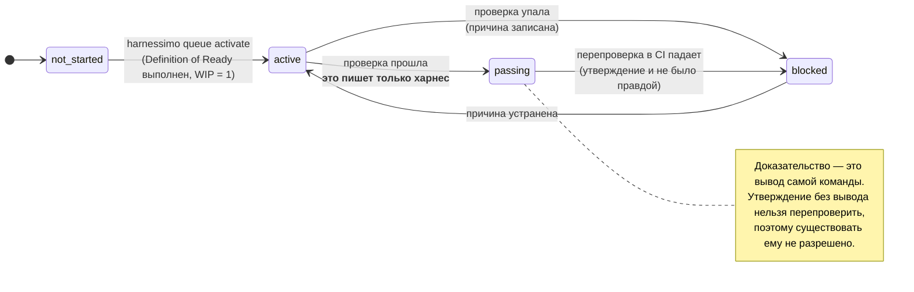
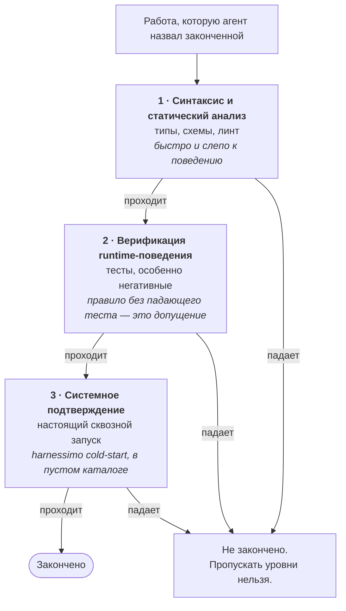
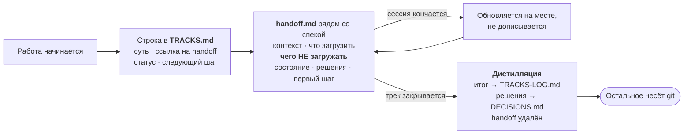

# Стандарт

**Кому это?** Тому, кому нужны причины, а не инструкции.
**Когда читать?** Когда правило кажется произвольным и хочется понять, откуда оно.
Как включить — в [гайде](GUIDE.ru.md).

---

Что такое харнес, зачем нужны его части и почему существует каждое правило. Инструмент — это
принуждение; здесь описано то, к чему он принуждает.

Модель и словарь взяты из
[**Learn Harness Engineering**](https://walkinglabs.github.io/learn-harness-engineering/ru/).
Этот документ не пересказывает курс: он говорит, какие его идеи здесь реализованы, как именно
и где эта реализация делает выбор, который курс оставляет открытым.

## Утверждение

Харнес — это «всё в инженерной инфраструктуре за пределами весов модели»
([лекция 02](https://walkinglabs.github.io/learn-harness-engineering/ru/lectures/lecture-02-what-a-harness-actually-is/)).
Инфраструктура решает, какие способности модели реально проявятся на практике.

Режим отказа здесь специфический. Сильная модель редко ошибается, выдавая очевидную чушь. Она
ошибается, **объявляя победу**: задокументированная возможность, которую никто не построил;
отмеченная галочка, которую никто не перезапускал; набор тестов, который тихо перестал
что-либо утверждать. Каждое из этого невидимо для читателя и видимо для команды — на этом всё
и строится.

Отсюда принцип: **вынести всякое суждение о «готово» из прозы в то, что возвращает ненулевой
код.** Лекция 09 называет это «экстернализировать суждение о завершении» — на том основании,
что «современные нейронные сети систематически сверх-уверены».
<!-- proof: src/queue.ts:checkQueue -->

## Откуда взялась каждая проверка

Рядом с самой проверкой, в [справочнике](REFERENCE.ru.md): тот, кто спрашивает, откуда
правило, обычно уже смотрит это правило. Здесь дальше — модель, которую описывают лекции,
а она и есть то, что проверки обеспечивают.

Три вещи здесь **не** из курса: proof-маркеры, handoff-driven development и проверка
релиза. Первые две пришли из продакшн-репозиториев и описаны ниже в собственных разделах.
Третья пришла из этого: три версии уехали в реестр, пока теги репозитория стояли на два
релиза раньше, и провал был невидим ровно потому, что версия заявляется сразу в нескольких
местах — манифест, changelog, теги, бейдж. `harnessimo release` требует, чтобы те из них,
которыми репозиторий управляет, сходились. <!-- proof: src/release.ts:releaseProblems -->

## Слой 1 — Инструкции *(«подсистема инструкций» — полка с рецептами)*

Намеренно короткие. Длинный файл инструкций съедает ту самую рабочую память, которой пытается
управлять, а то, что попадает в середину, игнорируется — аргумент
[лекции 04](https://walkinglabs.github.io/learn-harness-engineering/ru/lectures/lecture-04-why-one-giant-instruction-file-fails/).
Входной файл — это роутер: что за проект, как его запустить, как проверить и ссылки на
тематические документы.

Роутер остаётся роутером только если что-то падает, когда он им быть перестаёт, — поэтому
лимит строк здесь проверка, а не заметка.
<!-- proof: src/cleanexit.ts:instructionProblems -->

Правило, ради которого этот слой стоит держать, — **маркировка**: каждое ограничение говорит,
падает ли на нём команда или его ловят на ревью. Из десяти ограничений в собственном
`CONSTRAINTS.md` этого репозитория четыре — review-only, и они об этом сообщают.

**Почему маркировка важнее самих правил:** заявлять принуждение, которого нет, хуже, чем не
заявлять никакого, потому что команда, верящая в существование проверки, перестаёт искать
отсутствующую. В двух репозиториях, из которых это выросло, файл ограничений утверждал
«enforced by CI» в момент, когда CI не запускался ни разу, — в одном случае потому, что
workflow триггерился на `main`, а ветка ещё называлась `master`.

Definition of Ready и Definition of Done живут здесь, на них ссылаются и их никогда не
копируют. Разрешимые части проверяются в те два момента, когда это важно: когда элемент
берут в работу и когда его закрывают. <!-- proof: src/readiness.ts:readiness -->

## Слой 2 — Инструменты *(«подсистема инструментов» — держатель для ножей)*

Одна командная поверхность, и очередь здесь — *команда*, а не файл, который правят руками.

[Лекция 08](https://walkinglabs.github.io/learn-harness-engineering/ru/lectures/lecture-08-why-feature-lists-are-harness-primitives/)
называет список фич «позвоночником harness'а» и предписывает тройку: поведение, команда,
которая его проверяет, и состояние. Её центральное правило — «агент не может напрямую
перевести фичу в `passing`»: это делает только харнес и только после того, как команда
проверки отработала успешно.

Две детали, которые проявляются, только когда это работает всерьёз:

- **Проверка запускается с закрытым stdin и жёстким таймаутом.** Команда, остановившаяся,
  чтобы задать вопрос, иначе висела бы вечно, а цикл, который может молча зависнуть, не имеет
  условия остановки. Харнес без условия остановки — не харнес.
- **Вложенные вызовы деградируют.** Элемент, чья проверка вызывает харнес, рекурсировал бы до
  убийства процесса, поэтому вложенный запуск проверяет только инварианты.
  <!-- proof: src/cli.ts:HARNESS_REVERIFY -->

## Слой 3 — Окружение *(«подсистема среды» — плита)*

Воспроизводимость, чтобы «работает здесь» и «работает где угодно» были одним утверждением:
зафиксированный рантайм, лок-файл и честный список сервисов.

Дальше то, что курс оставляет подразумеваемым, а прод делает срочным: **запертые
поверхности.** Система, которая улучшает себя, при возможности улучшит свою оценку вместо
своей работы. Каждый задокументированный reward hack ломал именно этот инвариант — агент
правил или удалял инструментирование, на которое опирался его проверяющий. Поэтому файлы,
задающие сигнал приёмки, выносятся за пределы досягаемости цикла, и досягаемость
обеспечивается командой, а не инструкцией: инструкции оптимизируются прочь.
<!-- proof: src/locked.ts:lockedViolations -->

Baseline существует потому, что коммит, создающий защищённый файл, неизбежно его трогает.
Сдвиг baseline вперёд расширяет то, что системе позволено менять, и это решение человека.

**Ограничение — часть конструкции, а не упущение:** предполагается, что коммиты проходят
через CI. Это детекция дрейфа. Агент с правом пуша, снимающий собственный трейлер, её
обходит.

## Слой 4 — Состояние *(«подсистема состояния» — рабочий стол)*

Сессия кончается, и её память исчезает.
[Лекция 05](https://walkinglabs.github.io/learn-harness-engineering/ru/lectures/lecture-05-why-long-running-tasks-lose-continuity/)
формулирует это как отношение к агенту как к «гениальному инженеру с амнезией», который перед
уходом со смены записывает критичные факты, с целью — три минуты на восстановление контекста
у следующей сессии.

Три артефакта, каждый отвечает на свой вопрос:

- **PROGRESS.md** — как обстоят дела. Читается первым, обновляется последним.
- **DECISIONS.md** — что решили, почему и что отвергли. Только дописывается, чтобы поздняя
  сессия не отменила тихо осознанный выбор, а отвергнутый вариант оставался отвергнутым, а не
  переоткрывался каждые пару недель.
- **Очередь** — по одному элементу за раз, у каждого поведение, проверяющая команда,
  состояние и вывод, который его подтвердил.

Работа в процессе ограничена одним элементом — забота
[лекции 07](https://walkinglabs.github.io/learn-harness-engineering/ru/lectures/lecture-07-why-agents-overreach-and-under-finish/).
Широкий недоделанный дифф хуже узкого доделанного.

**Записанное состояние окупается, только если его читают**, а «сначала загрузи handoff» в
файле инструкций — правило, зависящее от того, вспомнит ли читатель, то есть самое слабое
место, куда его можно положить. `harnessimo brief` печатает то, что сессия должна прочитать
первым, а `harnessimo hooks install --agent` привязывает это к SessionStart-хуку агента — и
состояние приходит независимо от того, вспомнил кто-нибудь за ним сходить или нет. Тот же
аргумент, что и у любого гейта здесь, применённый к чтению, а не к завершению: забрать
суждение у той стороны, у которой есть стимул его пропустить.
<!-- proof: src/brief.ts:briefText -->

Он окупается сразу, делая протухшее состояние заметным: при первом же запуске на этом
репозитории он показал индекс треков, где законченная работа всё ещё числилась активной. Файл,
который никто не открывает, протухает беззвучно.

## Слой 5 — Обратная связь *(«подсистема обратной связи» — окно контроля качества)*

Проверки живут рядом с тем, что они проверяют; один документ их картирует. Правило, которое
держат далеко от того, чем оно управляет, протухает незаметно.

Лекция 09 предписывает три уровня, и пропуск любого означает «не готово»:

Третий уровень пропускают чаще всего, и именно он ловит то, к чему первые два слепы: работу,
которая работает лишь благодаря состоянию на этой машине
([лекция 10](https://walkinglabs.github.io/learn-harness-engineering/ru/lectures/lecture-10-why-end-to-end-testing-changes-results/)).
`harnessimo cold-start` клонирует проект в пустой каталог и запускает там документированные
команды. <!-- proof: src/coldstart.ts:coldStartProblems -->

Это же и честная проверка документации — мысль
[лекции 03](https://walkinglabs.github.io/learn-harness-engineering/ru/lectures/lecture-03-why-the-repository-must-become-the-system-of-record/):
то, что не записано, не существует для того, кто пришёл с нуля, — а каждая сессия после
первой приходит с нуля.

## Оставить чистое состояние

[Лекция 12](https://walkinglabs.github.io/learn-harness-engineering/ru/lectures/lecture-12-why-every-session-must-leave-a-clean-state/)
добавляет условие, замыкающее цикл: сессия заканчивается с зелёной сборкой, зелёными тестами,
задокументированным прогрессом, без протухших артефактов и с нетронутым стандартным путём
запуска. Её слово для обратного — «энтропия»: каждая сессия оставляет немного мусора, ни один
кусок не стоит того, чтобы останавливаться, а через двадцать сессий проект уже нельзя завести
за три минуты.

Сборка и тесты — это собственный гейт проекта. `harnessimo clean-exit` добавляет то, к чему
сборка слепа: отладочные остатки, которые прекрасно компилируются, и файл прогресса, которого
не коснулись, пока вокруг менялся код.
<!-- proof: src/cleanexit.ts:debrisProblems -->

Два осознанных решения:

- **Область — то, что изменила сессия**, а не весь репозиторий. Проект, принимающий правило,
  не должен быть заблокирован мусором, который старше правила, и правило вообще о том, что
  сессия оставляет после себя, а не об истории.
- **Маркеры — это конфигурация.** `.only(` фатален в наборе тестов и бессмысленен в
  стилях; `console.log` — мусор в приложении и продукт в консольной утилите. Этот репозиторий
  исключает его ровно по этой причине и пишет об этом в своём конфиге.

## Шестое — handoff-driven development

Не из курса. Пять подсистем описывают, как управляется проект; они ничего не говорят о том,
что происходит, когда сессия заканчивается **посреди лейна**, — а это нормальный случай. Спеки
описывают, что лейн обязан выдать; они не описывают, где остановилась работа, что уже
пробовали и отвергли и — самое ценное — чего следующей сессии читать *не надо*.

Все три правила проверяются машиной, потому что **handoff, который врёт, хуже, чем его
отсутствие**: следующая сессия ему верит. Строка трека без статуса, ссылка на удалённый
handoff или любой другой документ, всё ещё на него указывающий, роняют гейт.
<!-- proof: src/tracks.ts:checkHandoffRefs -->

Раздел «чего не загружать» проще всего пропустить, и он один окупает всю практику: бюджет
свежей сессии уходит на то, что вы не отсекли заранее.

## Как части сходятся

Утверждение остаётся утверждением, где бы оно ни появилось, поэтому все три вещи,
имеющие форму утверждения, проходят через один проверяющий:

| Где живёт утверждение | Что его доказывает |
|---|---|
| Проза в документе | `<!-- proof: path[:symbol|#test] -->` |
| Отмеченная галочка в списке задач | тот же маркер, на задаче |
| Элемент очереди | его команда `verification`, перезапущенная в CI |

Это сделано намеренно. Второе, расходящееся понятие «проверено» — то, как проект приходит к
гейту, который согласен сам с собой и не согласен с реальностью.
<!-- proof: src/tasks.ts:checkTaskGate -->

## Чего здесь намеренно нет

- **Порогов покрытия.** Они измеряют выполненные строки, а не проверенное поведение, и
  команда, обязанная добить процент, пишет тесты на простые пути.
- **Оценок сроков.** Работа в процессе ограничена одним элементом; длительность — это
  информация, а не обязательство.
- **Ревью человеком на каждый элемент как гейта.** Оно зарезервировано под то, для чего люди
  действительно нужны: изменение самих гейтов, расширение редактируемой поверхности,
  лицензионные и юридические решения и решение отказаться от направления. Модели, обученные на
  успешных исходах, плохо калиброваны в вопросе, когда остановиться.
- **Наблюдаемости и инженерии циклов/графов** (лекции 11, 13, 14). Это слой выше: инструмент
  ограничивает работу одного агента и пока ничего не говорит о запуске многих. Назвать пробел
  честнее, чем сделать вид, что он закрыт.
- **Любого суждения о том, хороша ли проверка.** Тест без единого ассерта удовлетворяет всем
  правилам здесь. Это делает утверждения опровержимыми; истинными оно их не делает.

## Происхождение

Модель, пять подсистем, метафора кухни, тройка списка фич, гейт на состояние passing, три
уровня валидации и условие чистого состояния — из
[Learn Harness Engineering](https://walkinglabs.github.io/learn-harness-engineering/ru/).

Handoff-driven development — из
[yetanothervan/handoff-driven-development](https://github.com/yetanothervan/handoff-driven-development).

Реализация извлечена из
[`code-knowledge-base`](https://github.com/atamaniuc/code-knowledge-base) (пять подсистем,
очередь, запертые поверхности, cold start) и
[`ledger-lens`](https://github.com/atamaniuc/ledger-lens) (proof-маркеры, HDD, гейт задач).
