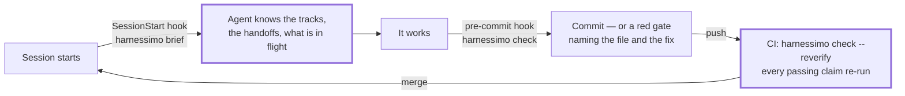

# Use cases

Seven situations this was built for, and what actually happens in each. If you only read one
section, read the first — it is the whole point: **you configure it once, and after that
nobody has to remember it exists.**

## Set it up once, then forget it

Three commands, run a single time in a repository:

=== "pnpm"

    ```bash
    pnpm exec harnessimo init                    # writes harnessimo.config.json from what you already have
    pnpm exec harnessimo hooks install --agent   # the agent gets a briefing at the start of every session
    pnpm exec harnessimo hooks install           # the fast checks run before every commit
    ```

=== "npm"

    ```bash
    npx harnessimo init                    # writes harnessimo.config.json from what you already have
    npx harnessimo hooks install --agent   # the agent gets a briefing at the start of every session
    npx harnessimo hooks install           # the fast checks run before every commit
    ```

=== "yarn"

    ```bash
    yarn harnessimo init                    # writes harnessimo.config.json from what you already have
    yarn harnessimo hooks install --agent   # the agent gets a briefing at the start of every session
    yarn harnessimo hooks install           # the fast checks run before every commit
    ```

=== "bun"

    ```bash
    bunx harnessimo init                    # writes harnessimo.config.json from what you already have
    bunx harnessimo hooks install --agent   # the agent gets a briefing at the start of every session
    bunx harnessimo hooks install           # the fast checks run before every commit
    ```

Plus ten lines in CI:

```yaml
- uses: actions/checkout@v5
  with: { fetch-depth: 0 }          # locked and clean-exit read a commit range
- uses: actions/setup-node@v5
  with: { node-version: 22 }
- run: npx harnessimo check --reverify
```

After that the harness fires at three moments on its own, with nobody in the loop:



This is the difference between a rule and a harness. A rule in `AGENTS.md` — *"verify before
you claim done"* — is obeyed on the runs you are watching. A hook is obeyed on the run at
3am that nobody sees. <!-- proof: src/hooks.ts:hookScript -->

**Autonomy is the payoff.** An agent can only be left alone as far as something other than
the agent decides when the work is finished. Once these three touchpoints exist, a long
unattended run either produces work that passes them or stops with a specific, actionable
failure — instead of a cheerful summary of things that did not happen.

---

## Two ways to run it

The checks do not care who is working. What differs is how they reach you.

### By hand

```bash
harnessimo check        # everything this repository asked for; the CI command
harnessimo doctor       # what is enforced here, and what is not
harnessimo proof docs/  # one check, one directory, while you edit
```

The pre-commit hook runs the fast ones, so the loop is the one you already have: write,
commit, and find out in a second rather than in CI. Nothing here needs an agent, an editor
integration or a subscription — a repository with no AI in it gets the same value from
`proof` and `cold-start`.

### By agent

An agent gets three things it cannot get from a line in `AGENTS.md`.

**At the start of a session** the SessionStart hook prints the state instead of hoping the
agent asks for it: live tracks, the head of each handoff, what is in flight, and which checks
this repository enforces. That is `harnessimo brief`, wired up by
`harnessimo hooks install --agent`.

**During the work** the queue takes one decision away from it: `harnessimo queue verify <id>`
runs the item's own command and records the outcome. The agent cannot write `passing`, and
`check --reverify` re-runs every claim in CI, so editing the state file by hand is caught
rather than trusted.

**At commit** it hits the same gate a person does — and `locked` additionally refuses a
commit carrying the agent trailer that touches the files defining success.

Put the three rules an agent must follow in your instruction file, where they are short
enough to survive:

```markdown
- Run `harnessimo check` before saying anything is done.
- Never edit state in the queue file; use `harnessimo queue verify <id>`.
- Starting a track means reading its handoff first — `harnessimo brief` prints them.
```

The rest is enforcement, and enforcement is not an instruction.

---

## 1. The README describes software that does not exist

*Brownfield, inherited repo, or an agent that documented its intentions.*

You write a claim once and attach its evidence:

```markdown
Totals round per currency, not per line.   <!-- proof: docs/<a-file>.md -->
Check it yourself with `make verify`.     <!-- proof: make <a-target> -->
```

(Real markers name a real path; the angle brackets above are only so this page's own
examples are not checked as claims.) Delete the document, or rename the target, and the
build says so:

```
FAIL  proof markers
  README.md:31  docs/ARCHITECTURE.md
      no such file
  README.md:32  make verify
      no make command named "verify"
```

**Turn on:** `docs`. Add the documents that may never drift to `docs.mustCarryProof` — those
must carry at least one marker, so a rewrite cannot quietly drop the evidence.
<!-- proof: src/proof.ts:verifyProofs -->

## 2. "Works on my machine" — and only there

*Onboarding, a new agent session, a fresh CI runner.*

`cold-start` clones your repository into an empty directory and runs the commands your own
documentation gives a newcomer. No caches, no environment carried over, nothing that only
exists on the machine that built it.

```
FAIL  cold start
  the clone ran: npm ci && npm test
    npm ci failed: package-lock.json is not committed
```

**Turn on:** `coldStart`, listing `requiredFiles`, `entryDocs` and the `commands` a newcomer
runs. <!-- proof: src/coldstart.ts:coldStartProblems -->

## 3. A feature that takes four sessions

*Context dies at the end of every session; the next one re-derives it, or re-decides a
question that was already settled.*

Live work lives in `specs/TRACKS.md` — one line per track, each pointing at a `handoff.md`
that says what to load, what *not* to load, where the work stopped and what the first step
is. The next session gets it handed over at startup rather than re-reading the repository:

```
$ harnessimo brief
== specs/TRACKS.md (live work tracks — load a track's handoff first) ==
- Checkout totals — [handoff](specs/0007-checkout/handoff.md) — active, next: T3 currency rounding
- Hosted deploy — none — blocked (on an API token)
```

The index is machine-checked, because a handoff that lies is worse than no handoff: a track
with no status, or a link to a handoff someone deleted, fails the gate.

**Turn on:** `tracks`. <!-- proof: src/tracks.ts:checkHandoffRefs -->

## 4. "Done" that stopped being true

*The task was genuinely finished in March. Something unrelated broke it in May, and the
board still says done.*

Each queue item carries its own verification command. Only the tool writes `passing`, and
only after that command exits 0 — and `--reverify` re-runs every one of them in CI:

```
FAIL  queue
  "checkout-totals" claims passing but its verification fails now
    command: npm test -- checkout
    fix:  fix the regression, or the claim was never true
```

Editing `state` by hand is not a shortcut; it is the thing this check catches.

**Turn on:** `queue`. <!-- proof: src/queue.ts:checkQueue -->

## 5. An agent that edits its own exam

*The fastest way to make a red build green is to change what "green" means.*

Name the surfaces that define success — the CI workflows, the constraints file, the eval
thresholds. A commit carrying the agent trailer that touches them fails the build:

```
FAIL  locked surfaces
  a1b2c3d  Co-Authored-By: Claude  touched .github/workflows/ci.yml
    fix:  a human makes this change, or the baseline records why it moved
```

This is drift detection in CI, not a sandbox — it catches the honest case, which is the
common one.

**Turn on:** `locked`, with `paths`, a `baseline` and your `agentTrailer`.
<!-- proof: src/locked.ts:lockedViolations -->

## 6. The long unattended run

*You start it and go to bed.*

`clean-exit` reads what the session actually changed and refuses the two ways a run ends
badly without failing: debris left in the code (`TODO`, `debugger`, `.only(` — you choose
the markers), and a progress file that stayed frozen while hundreds of lines changed around
it.

```
FAIL  clean exit
  src/checkout/totals.ts:88        debugger
  .harness/4-state/PROGRESS.md     unchanged while 412 lines of code moved
    fix:  write down where this got to, or the next session starts blind
```

**Turn on:** `cleanExit`. The `progressThreshold` keeps a one-line fix from tripping it.
<!-- proof: src/cleanexit.ts:progressProblems -->

## 7. "What does this repo actually enforce?"

*A new contributor, a code review, or you six months later.*

```
$ harnessimo doctor
  enforced      proof markers    docs claims resolve to real files, tests and commands
  enforced      work tracks      the track index resolves and every track carries a status
  not enforced  queue            no queue section in harnessimo.config.json
```

A check you did not configure is reported as *not enforced*, in the same output, with the
same weight. A harness that overstates its own coverage is the failure it exists to prevent.
<!-- proof: test/cli.test.ts#doctor reports what is enforced and what is not, without overstating -->

## 8. The version means different things in different places

*The badge says one thing, the registry serves another, and both are right about themselves.*

This one is not hypothetical: while writing this tool, three versions reached npm through a
manual workflow run while the repository's own tags stopped two releases earlier. Nothing
noticed, because nothing was checking the most duplicated claim a project makes.

```
FAIL  release
  CHANGELOG.md:1  v0.4.3
      0.4.3 is described as released and has no v0.4.3 tag
    why:  a version published outside the release flow leaves the repository behind
    fix:  cut the release, or remove the entry if it never shipped
```

**Turn on:** `release`, naming your manifest, your changelog and the tag prefix. It reads the
version from the manifest, the entries from the changelog and the tags from git; a version
nobody wrote down, an entry that is not at the top, or a released version with no tag all
fail. <!-- proof: src/release.ts:releaseProblems -->

---

## A full session, end to end

```
$ harnessimo brief
== specs/TRACKS.md (live work tracks — load a track's handoff first) ==
- Checkout totals — [handoff](specs/0007-checkout/handoff.md) — active, next: T3 currency rounding

== work queue ==
active: checkout-totals — an order total matches the sum of its lines, in every currency
  verify with: harnessimo queue verify checkout-totals

== enforced here ==
proof, tracks, tasks, queue, coldStart, cleanExit

# ... the agent works ...

$ harnessimo queue verify checkout-totals
running: npm test -- checkout
  ✓ 12 tests passed
checkout-totals: passing — evidence recorded

$ git commit -m "feat(checkout): per-currency rounding (0007)"
harnessimo: proof markers ok · tracks ok · task gate ok · queue ok
[main 4f1a2b9] feat(checkout): per-currency rounding (0007)
```

The commit went through because the checks passed, not because anybody said it was done.

---

Next: [what was taken from OpenSpec, Spec Kit, BMAD and the rest](SDD.md), or
[adopting it in an existing repo](ADOPTING.md).
