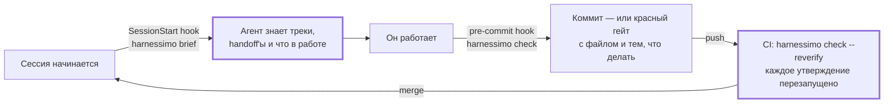

# Сценарии

Семь ситуаций, ради которых это писалось, и что в каждой происходит на самом деле. Если
прочитать только один раздел — читайте первый, в нём вся суть: **настраиваете один раз, и
дальше никому не нужно про это помнить.**

## Настроить один раз и забыть

Три команды, по разу на репозиторий:

=== "pnpm"

    ```bash
    pnpm exec harnessimo init                    # пишет harnessimo.config.json из того, что у вас уже есть
    pnpm exec harnessimo hooks install --agent   # агент получает брифинг в начале каждой сессии
    pnpm exec harnessimo hooks install           # быстрые проверки перед каждым коммитом
    ```

=== "npm"

    ```bash
    npx harnessimo init                    # пишет harnessimo.config.json из того, что у вас уже есть
    npx harnessimo hooks install --agent   # агент получает брифинг в начале каждой сессии
    npx harnessimo hooks install           # быстрые проверки перед каждым коммитом
    ```

=== "yarn"

    ```bash
    yarn harnessimo init                    # пишет harnessimo.config.json из того, что у вас уже есть
    yarn harnessimo hooks install --agent   # агент получает брифинг в начале каждой сессии
    yarn harnessimo hooks install           # быстрые проверки перед каждым коммитом
    ```

=== "bun"

    ```bash
    bunx harnessimo init                    # пишет harnessimo.config.json из того, что у вас уже есть
    bunx harnessimo hooks install --agent   # агент получает брифинг в начале каждой сессии
    bunx harnessimo hooks install           # быстрые проверки перед каждым коммитом
    ```

Плюс десять строк в CI:

```yaml
- uses: actions/checkout@v5
  with: { fetch-depth: 0 }          # locked и clean-exit читают диапазон коммитов
- uses: actions/setup-node@v5
  with: { node-version: 22 }
- run: npx harnessimo check --reverify
```

После этого харнес срабатывает сам в трёх точках, без участия человека:



В этом и разница между правилом и харнесом. Правило в `AGENTS.md` — *«проверь, прежде чем
говорить, что готово»* — соблюдается на тех прогонах, за которыми вы смотрите. Хук
соблюдается на прогоне в три часа ночи, которого не видит никто.
<!-- proof: src/hooks.ts:hookScript -->

**Автономность — это и есть выигрыш.** Агента можно оставить одного ровно настолько,
насколько не он решает, что работа закончена. Как только эти три точки существуют, долгий
прогон без присмотра либо выдаёт работу, которая их проходит, либо останавливается на
конкретном сообщении, с которым можно что-то сделать, — вместо бодрого пересказа того, чего
не произошло.

---

## Два способа этим пользоваться

Проверкам всё равно, кто работает. Отличается то, как они до вас доходят.

### Руками

```bash
harnessimo check        # всё, что этот репозиторий попросил проверять; команда для CI
harnessimo doctor       # что здесь обеспечивается, а что нет
harnessimo proof docs/  # одна проверка по одному каталогу, пока правите
```

Быстрые проверки запускает pre-commit хук, так что цикл остаётся тем же: пишете, коммитите и
узнаёте за секунду, а не в CI. Ничему из этого не нужны агент, интеграция с редактором или
подписка: репозиторий, рядом с которым нет никакого ИИ, получает от `proof` и `cold-start`
ровно ту же пользу.

### Агентом

Агент получает три вещи, которых не даст строчка в `AGENTS.md`.

**На старте сессии** SessionStart-хук печатает состояние, а не надеется, что агент про него
спросит: живые треки, начало каждого handoff'а, что в работе и какие проверки включены в
этом репозитории. Это `harnessimo brief`, который ставится командой
`harnessimo hooks install --agent`.

**Во время работы** очередь забирает у него одно решение: `harnessimo queue verify <id>`
запускает собственную команду задачи и записывает результат. Агент не может написать
`passing`, а `check --reverify` перезапускает в CI каждое утверждение — так что правка файла
состояния руками ловится, а не принимается на веру.

**На коммите** он упирается в тот же гейт, что и человек, а `locked` дополнительно
отказывает коммиту с трейлером агента, если тот трогает файлы, задающие успех.

Три правила, которые должен соблюдать агент, положите в файл инструкций — там они достаточно
коротки, чтобы выжить:

```markdown
- Перед словами «готово» запусти `harnessimo check`.
- Никогда не правь состояние в файле очереди — используй `harnessimo queue verify <id>`.
- Начать работу над треком значит сначала прочитать его handoff: их печатает `harnessimo brief`.
```

Остальное — это уже принуждение, а принуждение не бывает инструкцией.

---

## 1. README описывает то, чего не существует

*Унаследованный репозиторий или агент, задокументировавший свои намерения.*

Вы один раз пишете утверждение и прикрепляете к нему доказательство:

```markdown
Суммы округляются по валюте, а не по строке.   <!-- proof: docs/<файл>.md -->
Проверить самому: `make verify`.               <!-- proof: make <цель> -->
```

(Настоящий маркер называет настоящий путь; угловые скобки выше нужны только для того, чтобы
примеры на этой странице не проверялись как утверждения.) Удалите документ или переименуйте
цель — и сборка об этом скажет:

```
FAIL  proof markers
  README.md:31  docs/ARCHITECTURE.md
      no such file
  README.md:32  make verify
      no make command named "verify"
```

**Включить:** `docs`. Документы, которым нельзя расходиться с кодом, добавьте в
`docs.mustCarryProof` — они обязаны нести хотя бы один маркер, чтобы переписывание не могло
незаметно выбросить доказательство вместе с утверждением.
<!-- proof: src/proof.ts:verifyProofs -->

## 2. «У меня работает» — и только там

*Онбординг, новая сессия агента, чистый раннер CI.*

`cold-start` клонирует ваш репозиторий в пустой каталог и запускает те команды, которые ваша
же документация даёт новичку. Без кэшей, без перенесённого окружения, без того, что есть
только на машине, где это собиралось.

```
FAIL  cold start
  the clone ran: npm ci && npm test
    npm ci failed: package-lock.json is not committed
```

**Включить:** `coldStart`, перечислив `requiredFiles`, `entryDocs` и `commands`, которые
выполняет новичок. <!-- proof: src/coldstart.ts:coldStartProblems -->

## 3. Фича, которая занимает четыре сессии

*Контекст умирает в конце каждой сессии; следующая выводит его заново или заново решает уже
решённый вопрос.*

Живая работа лежит в `specs/TRACKS.md` — по строке на трек, каждая указывает на `handoff.md`,
где написано, что загрузить, чего *не* загружать, где работа остановилась и какой первый шаг.
Следующая сессия получает это на старте, а не перечитывает репозиторий:

```
$ harnessimo brief
== specs/TRACKS.md (live work tracks — load a track's handoff first) ==
- Checkout totals — [handoff](specs/0007-checkout/handoff.md) — active, next: T3 currency rounding
- Hosted deploy — none — blocked (on an API token)
```

Индекс проверяется машиной, потому что handoff, который врёт, хуже, чем его отсутствие: трек
без статуса или ссылка на удалённый handoff роняют гейт.

**Включить:** `tracks`. <!-- proof: src/tracks.ts:checkHandoffRefs -->

## 4. «Готово», которое перестало быть правдой

*Задача действительно была закончена в марте. В мае её сломало что-то постороннее, а на доске
по-прежнему «готово».*

У каждого элемента очереди есть своя команда проверки. `passing` пишет только инструмент и
только после того, как эта команда вернула 0, — а `--reverify` перезапускает их все в CI:

```
FAIL  queue
  "checkout-totals" claims passing but its verification fails now
    command: npm test -- checkout
    fix:  fix the regression, or the claim was never true
```

Поправить `state` руками — не короткий путь, а ровно то, что эта проверка и ловит.

**Включить:** `queue`. <!-- proof: src/queue.ts:checkQueue -->

## 5. Агент, который правит собственный экзамен

*Самый быстрый способ сделать красную сборку зелёной — поменять определение зелёного.*

Назовите поверхности, которые задают успех: workflow'ы CI, файл ограничений, пороги эвалов.
Коммит с трейлером агента, который их трогает, роняет сборку:

```
FAIL  locked surfaces
  a1b2c3d  Co-Authored-By: Claude  touched .github/workflows/ci.yml
    fix:  a human makes this change, or the baseline records why it moved
```

Это детекция дрейфа в CI, а не песочница: она ловит честный случай, который и является
частым.

**Включить:** `locked`, с `paths`, `baseline` и вашим `agentTrailer`.
<!-- proof: src/locked.ts:lockedViolations -->

## 6. Долгий прогон без присмотра

*Вы его запускаете и идёте спать.*

`clean-exit` читает то, что сессия на самом деле изменила, и не пропускает два способа плохо
закончить, не упав: мусор, оставленный в коде (`TODO`, `debugger`, `.only(` — маркеры
выбираете вы), и файл прогресса, который остался нетронутым, пока вокруг поменялись сотни
строк.

```
FAIL  clean exit
  src/checkout/totals.ts:88        debugger
  .harness/4-state/PROGRESS.md     unchanged while 412 lines of code moved
    fix:  write down where this got to, or the next session starts blind
```

**Включить:** `cleanExit`. Порог `progressThreshold` не даёт правке в одну строку уронить
проверку. <!-- proof: src/cleanexit.ts:progressProblems -->

## 7. «А что этот репозиторий вообще гарантирует?»

*Новый контрибьютор, ревью или вы сами через полгода.*

```
$ harnessimo doctor
  enforced      proof markers    docs claims resolve to real files, tests and commands
  enforced      work tracks      the track index resolves and every track carries a status
  not enforced  queue            no queue section in harnessimo.config.json
```

Проверка, которую вы не настроили, выводится как *not enforced* — там же и тем же весом.
Харнес, преувеличивающий собственное покрытие, — это тот самый провал, ради предотвращения
которого он существует.
<!-- proof: test/cli.test.ts#doctor reports what is enforced and what is not, without overstating -->

---

## Сессия целиком

```
$ harnessimo brief
== specs/TRACKS.md (live work tracks — load a track's handoff first) ==
- Checkout totals — [handoff](specs/0007-checkout/handoff.md) — active, next: T3 currency rounding

== work queue ==
active: checkout-totals — an order total matches the sum of its lines, in every currency
  verify with: harnessimo queue verify checkout-totals

== enforced here ==
proof, tracks, tasks, queue, coldStart, cleanExit

# ... агент работает ...

$ harnessimo queue verify checkout-totals
running: npm test -- checkout
  ✓ 12 tests passed
checkout-totals: passing — evidence recorded

$ git commit -m "feat(checkout): per-currency rounding (0007)"
harnessimo: proof markers ok · tracks ok · task gate ok · queue ok
[main 4f1a2b9] feat(checkout): per-currency rounding (0007)
```

Коммит прошёл, потому что прошли проверки, а не потому, что кто-то сказал, что готово.

---

Дальше: [что взято из OpenSpec, Spec Kit, BMAD и остальных](SDD.md) ·
[внедрение в существующий репозиторий](ADOPTING.md)
