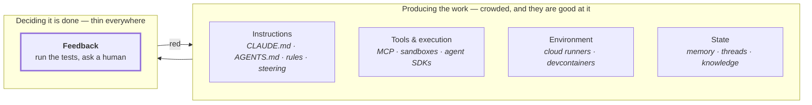
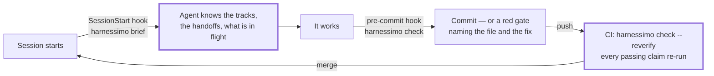

# Why this exists

**Who is this for?** Someone deciding whether to adopt this, before touching a terminal.
**When should I read it?** Before installing anything — it argues the case, and says when the
answer is no. Already decided? Go to the [guide](GUIDE.md).

---

**The honest question first: why would you add anything, when Kiro, Spec Kit, Copilot's
coding agent and three agent CLIs are mature, free and already in your editor?**

Because they are all on one side of the same line.

Every product in that left box makes an agent produce more, faster, with better context.
None of them changes **who decides the work is finished**. That decision is still the agent's
own report, checked by whatever your repository already had: a test suite, and a person with
time.

Harnessimo is only the right-hand box, and only the parts a command can settle.

## Configure it once, and it runs without you

Three hooks and one CI line, set up a single time:

This is the difference between a rule and a harness. A rule in `AGENTS.md` — *"verify before
you claim done"* — is obeyed on the runs you are watching. A hook is obeyed on the run at
3am that nobody sees. <!-- proof: src/hooks.ts:hookScript -->

**Autonomy is the payoff.** An agent can only be left alone as far as something other than
the agent decides when the work is finished. Once these three touchpoints exist, a long
unattended run either produces work that passes them or stops with a specific, actionable
failure — instead of a cheerful summary of things that did not happen.

## Where it sits next to the tools you know

| | What it is strongest at | What it does not do | What this adds |
|---|---|---|---|
| **[Kiro](https://kiro.dev)** (AWS) | specs, steering files and agent hooks in one IDE, carried across IDE/CLI/web | steering *guides*; the docs describe no gate that fails a build when a claim stops being true | a command that goes red, in your CI, for that exact case |
| **[Spec Kit](https://github.com/github/spec-kit)** (GitHub) | turning an intent into a spec, a plan and a task list | nothing re-runs the acceptance criteria; the task list is prose | a ticked box has to name a check, and the check has to pass |
| **[BMAD](https://github.com/bmad-code-org/BMAD-METHOD)** | the whole delivery loop with specialised perspectives | "verify" is a phase an agent performs and reports on | the queue: only a passing command writes `passing`, and CI re-runs them |
| **Copilot coding agent, Devin, Jules** | autonomy at scale, real sandboxes, PR-shaped output | verification is your existing CI plus human review | the checks that CI does not have because nobody writes them |
| **Claude Code, Codex, Cursor, Gemini CLI** | the harness *mechanism* — hooks, instruction files, tool access | they supply the mechanism, not the rules; what to enforce is your problem | nine rules worth enforcing, and the wiring to run them |
| **Danger JS, custom CI scripts** | arbitrary rules at PR time, if you write them | you write and maintain them, per repository, forever | the same rules, written once, tested, versioned, shared |

Two things follow from that table.

**It is not a competitor to any of them.** Nothing here generates code, plans work, holds
context, or runs an agent. Use Kiro or Spec Kit or BMAD to decide what to build. This tells
you afterwards whether what came back is what was claimed.

**It is the only one you keep when you switch.** `.kiro/`, `.cursor/` and every vendor's
memory format belong to that vendor. A `harnessimo.config.json`, proof markers in Markdown
and a `specs/` directory are files. They survive changing model, editor, subscription and
employer.

## Who it is for

**One person with three agents has a team lead's review load and no team.** That is the
situation this was built in, and it is the situation it pays for.

=== "Solo, agent-assisted"

    You stop re-reading diffs to find out whether the thing the agent said it finished is
    finished. `queue verify` runs the command; the tool writes the state. What you review is
    the design, not the claim.

=== "Vibe coding a real project"

    The README, the plan and the task list stay true as the thing moves, because they name
    evidence and the build resolves it. The next session — yours or an agent's — starts from
    something accurate instead of from fiction someone wrote three days ago.

=== "A team on an agentic SDLC"

    "Done" stops being a status a person types and becomes an exit code, identical for every
    person and every agent. New contributors get `harnessimo doctor` instead of tribal
    knowledge about what this repository actually guarantees.

=== "A long-lived codebase"

    Work crosses session boundaries in handoffs that are machine-checked, so a track cannot
    quietly point at a file somebody deleted, and a session cannot end without saying where
    it stopped.

**When it is not worth it**

- A weekend script, or anything you will not return to.
- You write the code yourself and review it yourself — the failures below are agent-shaped.
- Nobody will write the proof markers. They are the one manual part, and a repository where
  they are not written ends up with a gate that enforces nothing, which is worse than no
  gate because it looks like one.

## When to reach for it

| The moment | What it looks like |
|---|---|
| You caught the second wrong "done" | not the first — the first is noise, the second is a pattern |
| A document lied and cost you an hour | the README described infrastructure that was never built |
| A session re-derived what the last one knew | you explained the same decision twice |
| An agent changed a test to make a build green | which it will, given the opportunity |
| Someone asks what this repository guarantees | and the answer is a paragraph rather than a command |

## Why you can trust it

A tool that says "trust your build, not your memory" has to be checkable itself. Each of
these is a claim you can verify without asking anyone:

**Published by a workflow, not a person.** Releases are built and signed in GitHub Actions
and authenticated by OIDC trusted publishing. There is no npm token in this repository or
in its secrets to steal, and the workflow filename is part of the credential. Every version
carries a provenance statement naming the commit and workflow that produced it —
`npm audit signatures` checks it, and the transparency-log entry is public.

**Zero runtime dependencies**, enforced by its own CI rather than promised. Nothing it
installs can break the project it guards, and there is no supply chain under it to audit but
this one.

**It is held to its own standard.** All nine checks run against this repository, including
`--reverify`, which re-runs every claim that says it passes, and a cold start that clones the
repository into an empty directory and runs the commands the documentation gives a newcomer.

**Every rule has a test proving it fires on bad input.** A rule that has only
ever passed is an assumption wearing a rule's clothes. The tests run with nothing installed.

**Used, not only demonstrated.** Two public repositories deleted their own versions of these
checks and depend on this package:
[`ledger-lens`](https://github.com/atamaniuc/ledger-lens) (Next.js, Supabase, Python) and
[`code-knowledge-base`](https://github.com/atamaniuc/code-knowledge-base) (pnpm workspace,
content pipeline).

**It does not know which model you use, and cannot come to depend on one.** The checks read
files, run commands and walk git history; nothing in them is specific to a vendor, and the
one tool-specific piece — the automatic session briefing — has a one-line equivalent for
every other agent, printed by `harnessimo agent`. A tool that outlives your choice of model
is worth more than one that is excellent inside somebody's product.
<!-- proof: test/brief.test.ts#nothing in the contract is specific to one vendor's agent -->

**Small enough to read, and MIT.** About three thousand lines of TypeScript with no runtime,
no daemon and no service behind it. If it were abandoned tomorrow you could vendor it in an
afternoon — which is the honest answer to "what if this project dies", and the reason it is
deliberately not a platform.

**What it will not claim.** It does not judge whether your tests are any good — a test that
asserts nothing satisfies every rule here. `locked` is drift detection in CI, not a sandbox:
an agent with push access that strips its own authorship trailer defeats it, and saying so
is the point. It reviews nothing, and it knows nothing about your code's correctness.

---

Next: [the 15-minute guide](GUIDE.md) · [what it looks like in practice](REFERENCE.md) ·
[what was taken from each system](SDD.md)
