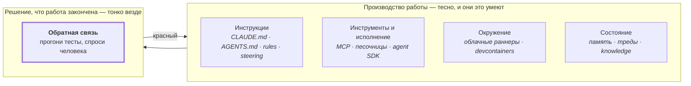

# Зачем это

**Сначала честный вопрос: зачем добавлять что-то ещё, когда Kiro, Spec Kit, кодовый агент
Copilot и три агентных CLI зрелые, бесплатные и уже стоят у вас в редакторе?**

Потому что все они находятся по одну сторону одной и той же черты.

Каждый продукт в левом блоке заставляет агента производить больше, быстрее и с лучшим
контекстом. Ни один не меняет того, **кто решает, что работа закончена**. Это решение
по-прежнему остаётся отчётом самого агента, который проверяет то, что у вас и так было:
набор тестов и человек, у которого есть время.

Harnessimo — только правый блок, и только та его часть, которую может закрыть команда.

## Где он рядом с инструментами, которые вы знаете

| | В чём силён | Чего не делает | Что добавляем мы |
|---|---|---|---|
| **[Kiro](https://kiro.dev)** (AWS) | спеки, steering-файлы и хуки агента в одной среде, доступные из IDE, CLI и веба | steering *направляет*; гейта, который роняет сборку, когда утверждение перестало быть правдой, в его документации нет | команда, которая краснеет в вашем CI ровно на этом случае |
| **[Spec Kit](https://github.com/github/spec-kit)** (GitHub) | превращение намерения в спеку, план и список задач | критерии приёмки никто не перезапускает, список задач — это проза | галочка обязана называть проверку, а проверка обязана проходить |
| **[BMAD](https://github.com/bmad-code-org/BMAD-METHOD)** | весь цикл поставки с ролями-перспективами | «verify» — фаза, которую выполняет и о которой отчитывается агент | очередь: `passing` пишет только прошедшая команда, и CI перезапускает их все |
| **Copilot coding agent, Devin, Jules** | автономность в масштабе, настоящие песочницы, результат в виде PR | проверка — это ваш существующий CI плюс ревью человека | те проверки, которых в CI нет, потому что их никто не пишет |
| **Claude Code, Codex, Cursor, Gemini CLI** | сам *механизм* харнеса: хуки, файлы инструкций, доступ к инструментам | они дают механизм, а не правила; что именно проверять — ваша забота | восемь правил, которые стоит проверять, и их проводка |
| **Danger JS, самописные CI-скрипты** | произвольные правила на PR, если вы их напишете | вы их пишете и поддерживаете, в каждом репозитории, вечно | те же правила, написанные один раз, с тестами и версиями |

Из этой таблицы следуют две вещи.

**Он не конкурент ни одному из них.** Здесь ничто не генерирует код, не планирует работу, не
держит контекст и не запускает агента. Решайте, что строить, с помощью Kiro, Spec Kit или
BMAD. Этот инструмент говорит потом, соответствует ли результат тому, что о нём заявили.

**И он единственный, что остаётся при переезде.** `.kiro/`, `.cursor/` и любой вендорский
формат памяти принадлежат вендору. `harnessimo.config.json`, proof-маркеры в markdown и
каталог `specs/` — это просто файлы. Они переживают смену модели, редактора, подписки и
работодателя.

## Кому это нужно

**Один человек с тремя агентами несёт ревью-нагрузку тимлида и не имеет команды.** Это та
ситуация, в которой инструмент писался, и та, в которой он окупается.

=== "Соло с агентами"

    Вы перестаёте перечитывать диффы, чтобы понять, действительно ли готово то, что агент
    назвал готовым. `queue verify` запускает команду, инструмент пишет состояние. Вы ревьюите
    решение, а не утверждение о нём.

=== "Вайб-кодинг реального проекта"

    README, план и список задач остаются правдой по мере движения, потому что называют
    доказательства, а сборка их проверяет. Следующая сессия — ваша или агента — начинается с
    чего-то точного, а не с вымысла трёхдневной давности.

=== "Команда на agentic SDLC"

    «Готово» перестаёт быть статусом, который кто-то проставил, и становится кодом возврата,
    одинаковым для каждого человека и каждого агента. Новичок получает `harnessimo doctor`
    вместо устного знания о том, что этот репозиторий на самом деле гарантирует.

=== "Долгоживущая кодовая база"

    Работа переходит через границы сессий в handoff'ах, которые проверяются машиной: трек не
    может незаметно указывать на файл, который кто-то удалил, а сессия не может закончиться,
    не сказав, где остановилась.

**Когда не окупается**

- Скрипт на выходные или что угодно, к чему вы не вернётесь.
- Вы пишете код сами и сами же его ревьюите — провалы ниже имеют агентную форму.
- Proof-маркеры некому писать. Это единственная ручная часть, и репозиторий, где их не пишут,
  получает гейт, который ничего не гарантирует, — а это хуже, чем отсутствие гейта, потому
  что выглядит как гейт.

## Когда за него браться

| Момент | Как это выглядит |
|---|---|
| Вы поймали второе неверное «готово» | не первое: первое — шум, второе — закономерность |
| Документ соврал и стоил вам часа | README описывал инфраструктуру, которую не построили |
| Сессия заново вывела то, что знала предыдущая | вы объяснили одно и то же решение дважды |
| Агент поправил тест, чтобы сборка позеленела | а он поправит, если дать возможность |
| Кто-то спросил, что гарантирует этот репозиторий | и ответом был абзац, а не команда |

## Почему этому можно доверять

Инструмент, который говорит «верь сборке, а не памяти», обязан сам быть проверяемым. Каждый
пункт ниже можно подтвердить, ни у кого не спрашивая:

**Публикует workflow, а не человек.** Релизы собираются и подписываются в GitHub Actions и
аутентифицируются через OIDC trusted publishing. В репозитории и его секретах нет npm-токена,
который можно украсть, а имя файла workflow — часть учётных данных. Каждая версия несёт
provenance-заявление с коммитом и workflow, из которых собрана: `npm audit signatures` это
проверяет, а запись в прозрачном логе публична.

**Ноль рантайм-зависимостей** — не обещание, а правило, которое проверяет собственный CI.
Ничто из установленного не может сломать проект, который он охраняет, и аудировать под ним
нечего, кроме него самого.

**Он живёт по собственному стандарту.** Все восемь проверок применяются к этому репозиторию,
включая `--reverify`, который перезапускает каждое утверждение о прохождении, и cold start,
который клонирует репозиторий в пустой каталог и выполняет команды, которые документация даёт
новичку.

**131 тест, и у каждого правила есть тест, доказывающий срабатывание на плохом входе.**
Правило, которое умеет только проходить, — это допущение в одежде правила. Тесты запускаются
без установки чего-либо.

**Используется, а не только демонстрируется.** Два публичных репозитория удалили собственные
версии этих проверок и зависят от пакета:
[`ledger-lens`](https://github.com/atamaniuc/ledger-lens) (Next.js, Supabase, Python) и
[`code-knowledge-base`](https://github.com/atamaniuc/code-knowledge-base) (pnpm-воркспейс,
контентный пайплайн).

**Он не знает, какой моделью вы пользуетесь, и не может от неё зависеть.** Проверки читают
файлы, запускают команды и ходят по истории git; ничто в них не привязано к вендору, а
единственная зависящая от инструмента часть — автоматический брифинг сессии — имеет
однострочный эквивалент для любого другого агента, который печатает `harnessimo agent`.
Инструмент, переживающий ваш выбор модели, стоит больше, чем отличный инструмент внутри
чужого продукта.
<!-- proof: test/brief.test.ts#nothing in the contract is specific to one vendor's agent -->

**Достаточно мал, чтобы прочитать, и под MIT.** Около трёх тысяч строк TypeScript без
рантайма, без демона и без сервиса за спиной. Если проект забросят завтра, вы вендорите его
за вечер — это честный ответ на вопрос «а если он умрёт» и причина, по которой он намеренно
не платформа.

**Чего он не станет утверждать.** Он не судит о качестве ваших тестов: тест без единого
ассерта проходит все правила здесь. `locked` — детекция дрейфа в CI, а не песочница: агент с
правом пуша, снявший собственный трейлер авторства, обходит её, и сказать об этом прямо —
часть смысла. Он ничего не ревьюит и ничего не знает о корректности вашего кода.

---

Дальше: [гайд за 15 минут](GUIDE.md) · [как это выглядит на практике](USE-CASES.md) ·
[что взято из каждой системы](SDD.md)
