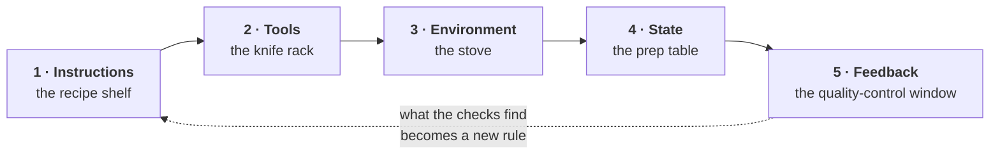

# The harness

This folder holds everything that governs *how* work gets done here, as opposed to the work
itself. If you are new to the project, this is the shortest route to understanding how it
runs.

A harness is everything in the engineering infrastructure outside the model's weights: the
instructions it is given, the tools it can run, the environment it runs in, the state it
carries between sessions, and the checks that tell it whether it succeeded. A capable model
with a bad harness produces work that looks finished and is not; that is the problem this
folder exists to solve.

| Folder | What it holds |
|---|---|
| `1-instructions/` | The rules, and which of them a command enforces |
| `2-tools/` | What the project can run |
| `3-environment/` | What it runs in, and what is out of reach |
| `4-state/` | `PROGRESS.md`, `DECISIONS.md`, the work queue |
| `5-feedback/` | How it knows it worked |

All five are mandatory. A kitchen missing a zone is still a kitchen, and you will not cook
in it.

The entry point, `AGENTS.md`, stays in the project root because that is where every tool
looks for it. It is a router: what this project is, how to run it, how to check it, and
links here.

Unfinished work crosses sessions through `specs/TRACKS.md` and the handoffs it indexes.
State is what the harness cannot infer; a handoff is what the next session cannot
reconstruct from git in one pass.

Run `harness doctor` for the honest list of what is enforced here and what is not.

---

The model comes from
[Learn Harness Engineering](https://walkinglabs.github.io/learn-harness-engineering/ru/);
the tooling is [`@atamaniuc/harness`](https://github.com/atamaniuc/harness), whose
[guide](https://github.com/atamaniuc/harness/blob/main/docs/GUIDE.md) is the fastest way in.
